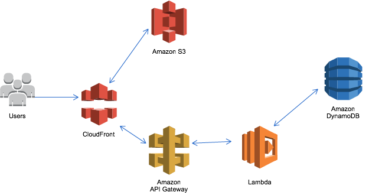

slidenumbers: true
autoscale: true

# サーバレスアーキテクチャ はじめの一歩
### JAWS-UG京都 「SERVERLESS祭 ～サーバレスでアプリを作ってみよう～」 2017/04/22 中山 幸治

---
# 自己紹介

- 中山 幸治
- クラスメソッド AWS事業部 ソリューションアーキテクト
  - AWSを利用したインフラの設計/構築/コンサルティング
- GitHub: [knakayama](https://github.com/knakayama)
- 経歴
  - オンプレサーバの運用3年
  - AWS 1年

---
# アジェンダ

1. Serverlessが話題になる背景
1. Serverlessとは何か
1. Serverlessの利点
1. Serverlessを支えるツール
1. 社会は甘くない
1. まとめ
1. 参考リンク

---
# 注意点

- 本スライドは現時点の情報を前提にしています
- Serverless界隈のアップデートは早いので利用する際は最新の情報を参照すること
- AWS以外の話(GCPとかAzureとかOpenWhiskとか)は知見がないので割愛

---
# 1. Serverlessが話題になる背景

---
# シンプルなWeb DBアーキテクチャを考えてみる

---

---

## シンプルな構成

- ELBでバックエンドのEC2にトラフィック流す
- EC2でRDSアクセス
- RDSにデータ保存

---
## EC2を利用した場合の課題

- 日々の運用
  - 監視
  - ソフトウェアのアップデート
  - 脆弱性対応

---
# OS以上のレイヤは利用者側で管理する必要がある

---
# できるならやりたくない

---
# なぜ運用が必要になるのか

- ユーザに価値を届けるためにサービスを作る
- サービスを作るためにコードを書く
- コードを動かすためにサーバが必要になる
- サーバが正常に動作し続けるために運用が必要になる

---
# もっとサービス(コード)に 集中したい

---
## ここまでのまとめ

- 運用はできるならやりたくない
- 本来の目的はサービスを作ってユーザに価値を提供すること
- そのためにサービス(コード)のみに集中したい
- Serverlessが登場する背景にはこういった事情がある

---
# 2. Serverlessとは何か

---
## Serverlessとは何か

- 一般的にはFunction as a Service(FaaS)を中心としたアーキテクチャ
  - AWSではLambda
  - ただし、Lambdaすら使わないアーキテクチャをこう呼ぶ場合もある(Lambdaless)
  - この辺は割と曖昧
- イベントドリブンという特徴がある
  - 何らかのイベントを契機としてピタゴラスイッチ的に各種処理が実行される

---
## Lambda

- コードを実行できるコンピューティングサービス
- サーバやプロセスを開発者側で管理する必要がない
- リクエスト/実行時間に応じた従量課金制
  - 安い
  - 無料利用枠も充実
  - EC2の場合最低1時間単位で課金
- 現時点で公式サポートしている言語はNode.js/Python/Java/C#
  - ただし別の言語も実行可能

---
# イベントドリブン？

---
## S3 Event Notification

- S3に発生したイベント(Put/Deleteなど)を契機に各種処理を実行できる仕組み

1. 管理者がアップロード用バケットに画像をPut
1. S3 Event NotificationでLambda起動
1. Lambdaで画像を加工し、表示用バケットにPut
1. ユーザはCloudFront経由で画像を表示

---
## SNS Notification

- SNSトピック経由でLambda起動可能

1. しきい値を超過したのでCloudWatch Alarm発火
1. CloudWatch AlarmのアクションでSNSトピックに通知
1. トピックをサブスクライブしているLambdaを実行
1. LambdaからSlackに通知

---
## Kinesis Firehose

- Kinesis Firehoseのストリーム契機でLambda起動可能

1. プロデューサからKinesis Firehoseにストリームデータ投入
1. ストリームデータが投入されるとLambdaが起動されてETL処理実施
1. 最終的に加工されたデータをS3にPut

---
# 3. Serverlessの利点

---
# 先程の図をServerlessな感じに 置き換えてみる

---

---
## Serverlessなアーキテクチャ

- CloudFrontでパスベースルーティング
  - パスに応じてS3かAPI Gatewayにトラフィック流す
- S3のWebホスティングでUI表示
- API GatewayのIntegrationでLambda起動
- LambdaからDynamoDBにput\_item/get\_item
- データストアとしてDynamoDB
  - Lambda on VPC + RDSでもOK

---
## Serverlessの利点

- マネージドサービスを中心としたアーキテクチャなので運用面をAWSにおまかせできる
  - サービス(コード)の開発にリソースを集中できる
- 自然と疎結合(マイクロサービス)なアーキテクチャになる
  - 1つのLambdaで全ての処理を実施するのは現実的じゃないので、自然と適切な粒度で分離していく
- 一般的にEC2を中心としたアーキテクチャよりもコストを抑えられる
  - Lambdaがリクエストベースの課金体系なのが大きい

---
# 4. Serverlessを支えるツール

---
## Serverlessアーキテクチャの課題

- Lambdaを動作させるのは意外と面倒くさい
  - マネジメントコンソールで直接コード書く
  - ローカルでコード書く → Zipに固める → アップロードする
- Lambda一個だけで完結するような構成はほぼない
  - 複数のAWSリソースを利用するのが当たり前
- テストをしたい
  - ユニットテスト
  - ローカル環境でのテスト
- この辺を上手くやってくれる仕組みがほしい

---
# フレームワーク

---
## フレームワーク

- デプロイメントパッケージ作成プロセスの簡素化
- Serverlessアーキテクチャ全体のコード化
  - CloudFormation
  - Terraform
- コード化による利点
  - 再現性
  - Git/GitHub/PR駆動開発
  - CI/CDを利用したデプロイパイプライン化

---
## 代表的なフレームワーク

|                       | Serverless Framework                                       | AWS Serverless Application Model(AWS SAM)                                                                             | Apex                                                       |
|-----------------------|------------------------------------------------------------|-------------------------------------------------------------------------------------|------------------------------------------------------------|
| 実装                  | Node.js                                                    | 知らん(Java?)                                                                       | Go                                                         |
| マルチクラウド        | Yes                                                        | No                                                                                  | No                                                         |
| OSS                   | Yes                                                        | No                                                                                  | Yes                                                        |
| AWSリソースの作成方法 | CloudFormation(一部非対応)                                 | CloudFormation                                                                      | Terraform                                                  |
| CLIの有無             | Yes(sls)                                                   | No(AWS CLI?)                                                                        | Yes(apex)                                                  |
| その他                | プラグインによる拡張 ローカル実行のサポート 多機能 利用者多い？ | AWS謹製 Swagger & ChangeSetサポート 厳密に言うとフレームワークではなくモデル | Hookサポート Go言語のサポート厚い？ Dry-runサポート シンプル |

---
# テストツール

---
## ユニットテスト

- Lambdaは外部から渡されたデータを処理する関数と捉えることもできる
  - AWSの場合Lambdaに渡されるデータは単なるJSON
- 既存テストモジュールを使ったユニットテストが可能
  - 特定のJSONを渡す → 結果が期待したものか確認
- Node.jsのchaiとかよく使われてるっぽい
  - http://qiita.com/horike37/items/15bf675f973d30bb1f5c
- Pythonだったらpytest
  - https://librabuch.jp/blog/2016/07/aws-lambda-environment/

---
## ローカル環境でのテスト

- テストをするのにAWS環境をいちいち用意するのは面倒
- ローカルでAWSと同等の機能をするものや、モック系のツールを利用する

| ツール                                                                                               | 概要                                                     |
|------------------------------------------------------------------------------------------------------|----------------------------------------------------------|
| Serverless Framework [lambda-local](https://github.com/ashiina/lambda-local)                     | Lambdaの入出力をローカルで再現可能                       |
| [DynamoDB Local](http://docs.aws.amazon.com/amazondynamodb/latest/developerguide/DynamoDBLocal.html) | DynamoDBと同等の機能をローカルで再現可能 AWS謹製     |
| [mhart/kinesalite](https://github.com/mhart/kinesalite)                                              | Kinesisの入出力をローカルで再現可能                      |
| [spulec/moto](https://github.com/spulec/moto)                                                        | AWSサービスの入出力をローカルで再現可能                  |
| [atlassian/localstack](https://github.com/atlassian/localstack)                                      | 複数のローカル実行系サービスをまとめたフルスタックツール |

---
# 5. 社会は甘くない

---
## 社会は甘くない

- Lambdaにはそれなりに制約がある
  - 最大実行時間5分
  - 最大ストレージ512MB(/tmp)
- 既存の技術とマッチしない場合もある
  - Ruby on Railsとか
- 全てのEC2を置き換えるものではない
  - 場合によってコンテナ(ECS)サービスも検討する
- 適材適所で利用すること

---
[.footer: https://www.slideshare.net/keisuke69/aws-lambda-amazon-api-gateway-deep-dive]

## Serverlessがハマりやすいユースケース

- リアルタイムファイル処理
  - S3のEvent NotificationでLambda起動 → 画像処理
- リアルタイムストリーム処理
  - Kinesis → LambdaでETL → S3やDynamoDB
- APIバックエンド
  - API GatewayとのIntegration → Lambda → データストア
- SNSトピックとの連携
  - AWSサービス間のハブとなるSNSトピック → Lambda起動 → 任意の処理

---
# 6. まとめ

---
## まとめ

- AWSを利用するならServerlessアーキテクチャを使ってみよう
- 無理にアーキテクチャ全体をServerless化しすぎない
- 要件的に難しそうであれば素直にEC2/ECSを検討する
- まずはスモールスタートから始める

---
# おわり

---
# 7. 参考リンク

---
## Serverlessとは何か

- https://rebuild.fm/160/
- https://martinfowler.com/articles/serverless.html
- http://dev.classmethod.jp/cloud/aws/serverless-meetup-20160802/

---
## Serverlessなアーキテクチャ

- https://speakerdeck.com/ikait/serverless-architecture-supports-nikkeis-paper-viewer

---
## Serverlessを支えるツール

- https://github.com/serverless/serverless
- https://github.com/awslabs/serverless-application-model
- https://github.com/apex/apex
- https://speakerdeck.com/horike37/serverless-framework-workshop
- https://medium.com/vandium-software/unit-testing-aws-lambda-functions-in-node-js-7ad6c8f5000

---
## 社会は甘くない

- http://docs.aws.amazon.com/lambda/latest/dg/limits.html
- https://www.slideshare.net/keisuke69/aws-lambda-amazon-api-gateway-deep-dive
