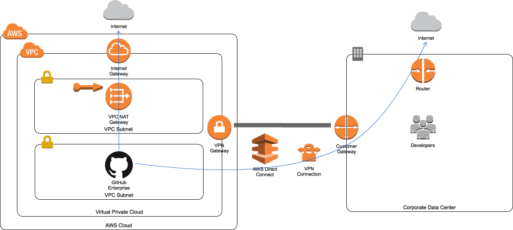

slidenumbers: true
autoscale: true

# GitHub EnterpriseとAWSを<br/>組み合わせたCDP
### GitHubとクラスメソッドの勉強会<br/>〜GitHub x AWSの最新DevOps事情〜
### 2017/04/26 中山 幸治

---
# 自己紹介

- 中山 幸治
- クラスメソッド AWS事業部 ソリューションアーキテクト
  - AWSを利用したインフラの設計/構築/コンサルティング
- GitHub: [knakayama](https://github.com/knakayama)
- 経歴
  - オンプレサーバの運用3年
  - AWS 1年


---
# アジェンダ

1. 今日お話する内容
1. AWSを使う上での基本姿勢
1. GitHub Enterpriseを使う上での基本姿勢
1. CDPの紹介
1. まとめ
1. 参考リンク

---
# 注意点

- GitHub EnterpriseはGHEと表記する
- GHEは発表時最新バージョンである2.9系を想定
- AWSも現時点の情報を前提にする
- 両サービスともアップデートが早いので利用する際は最新の情報を参照すること

---
# 1. 今日お話する内容

- GHEをAWSで使っていく際の課題とその解法をご紹介
- 割りとOps寄りな内容が多め
- 後でスライド公開します
- 参考リンクを乗せているので詳細を知りたい場合は参照ください

---
# 2. AWSを使う上での基本姿勢

- 第一にマネージドサービスの利用を検討すること
  - 安定性
  - 他サービスとの連携
  - 運用負荷の低減
- 標準サービスでは要件に合わない場合に自分たちで作る
- 会社が投資すべきビジネスロジックに集中する

---
# 3. GHEを使う上での基本姿勢

- 基本的にGHE自身の設定を弄らない
- GHEのアップデートで/data/user以外全て上書きされるため
- GitHubが提供してくれている標準機能を使う
  - 運用負荷を低減した形でGHEを管理できる

---
# 4. CDPの紹介

---
# 課題1

---
# GHEをインターネットに<br/>公開したくない

---
## GHEをインターネットに公開したくない

- GitHub.comがあるにも関わらずGHEを利用する動機はいくつかある
- セキュリティ上の要件から社外にソースコードを置きたくないと考えるお客様は多い
  - プライベートリポジトリをパブリックにしてしまった
  - アクセスキーをコミットに含めてしまった
  - 社内のLDAPサーバでログイン管理したい

---
# プライベートNWパターン

---


## 構成

- 社内NWとVPC間をセキュアに接続
- ハードウェアVPN
  - インターネット回線をIPsec VPNで暗号化
- Direct Connect
  - 専用線でVPCと接続

---


## 選定ポイント

|                  | ハードウェアVPN                                                        | Direct Connect                                                         |
|------------------|------------------------------------------------------------------------|------------------------------------------------------------------------|
| コスト           | 安価なベストエフォート回線も利用可能                                   | キャリアの専用線サービスの契約が必要                                   |
| リードタイム     | 即時~                                                                  | 数週間~                                                                |
| 帯域             | 暗号化のオーバーヘッドにより制限あり                                   | ~10Gbps                                                                |
| 品質             | インターネットベースのため経路上のネットワーク状態の影響を受ける       | キャリアにより品質が保証されている                                     |
| 障害時の切り分け | インターネットベースのため自社で保持している範囲以外の切り分けが難しい | エンドツーエンドでどの経路を利用しているか把握できているため比較的容易 |

[.footer: https://www.slideshare.net/AmazonWebServicesJapan/aws-black-belt-online-seminar-2016-amazon-vpc/66]
---


## インターネットへのアクセス

- GHEからインターネットに出ていくためには、NAT Gatewayか社内NWのゲートウェイを利用する
- ルートテーブルの設定は以下のようにする

| Destination | Target  | 構成                 |
|-------------|---------|----------------------|
| 0.0.0.0/0   | nat-xxx | NAT Gateway経由      |
| 0.0.0.0/0   | vgw-xxx | 社内ゲートウェイ経由 |

---
# 課題2

---
# GHEのバックアップがしたい

---
## GHEのバックアップがしたい

- 大事なソースコードを保管しているGHEのバックアップは必須
  - オペミスなどでデータの消失が起こる可能性はどの組織でもある
- バックアップ/リストアするためのツールをGitHubが公開してくれている
- https://github.com/github/backup-utils
- ただし、ツールを実行するインスタンスの管理はしたくない

---
# マネージドバックアップパターン

---


## DatePipeline

- GHEのバックアップ処理をDatePipelineで定義
  - 各種データの移動や、取得などを定義できる
  - ワークフローをビジュアライズに表示してくれる
  - バックアップのようなバッチ処理の定義に最適

---


## ワークフロー

- スケジュールで定期的にEc2Resourceを起動
- 起動したインスタンスでShellCommandActivityを実行
- シェルコマンドの中でghe-backupコマンドを実行
- EBSまたはEFSにバックアップデータを保存
- バックアップの取得に失敗した場合、SNSトピック経由で管理者に通知

---


## リストア

- リストア時に一時的にインスタンスを起動
- 起動したインスタンスでEBSかEFSをマウント
- `ghe-restore` コマンドを実行してリストア
- もちろん、リストア処理をDatePipelineで定義することも可能

---
# 課題3

---
# GHEのEmail Notificationを使いたい

---
## GHEのEmail Notificationを使いたい

- Email NotificationとはGHEのイベント発生時にメールで通知してくれる機能
  - PR/Issue/etc...
- GHEの場合、自分で送信用メールサーバを構築する必要がある
- それ用のメールサーバがない場合、この機能を利用するためだけに構築するのはシンドい

---
# マネージドEmail Notification<br/>パターン

---


## SES

- GHEからSES経由でNotificationを送信
- GHEとSESは別リージョンでもOK
- SESのメール送信はボタンポチポチで簡単にセットアップ可能
- SESを使うならドメイン管理をRoute53でやると簡単

---


## セットアップ

- SES環境をサンドボックス外に移動
- SMTP認証用IAMユーザの作成
- 送信元ドメインの認証
- GHEのマネジメントコンソールからSMTPの設定

---
# 課題4

---
# GHEを楽に管理したい

---
## GHEを楽に管理したい

- GHEのログを保存したり、メトリクスを収集したい
  - でもエージェントなどのソフトウェアをGHE自体にインストールするのは避けたい
- ログはフォワーディングすることにより転送可能
  - ログイン履歴/アプリケーションログ/etc...
- SNMPでメトリクスを収集可能
  - CPU/ストレージ容量/メモリ/etc...

---
# Workerパターン

---


## ログのアーカイブ

- GHEでログフォワーディングを有効化
- UDP:514でGHEからログを収集
- fluentd-plugin-s3でS3に保存
- プライベートNWパターンの場合はVPC Endpointを利用すること
- S3はデータレイクとして利用可能なので将来的に分析/可視化といったことも可能

---


## ログの監視

- GHEでログフォワーディングを有効化
- fluent-plugin-cloudwatch-logsでCloudWatch Logsにログを転送
- Metrics Filterを利用して特定の文字列にマッチした場合SNSトピックに通知

---


## リソースの監視

- GHEでSNMPモニタリングを有効化
- CollectdをインストールしたインスタンスでGHEのメトリクスをSNMP経由で収集
- CollectdからCloudWatch Metricsへの転送はAWS公式プラグインを利用
- https://github.com/awslabs/collectd-cloudwatch

---
# 課題5

---
# GHEにマルチドメイン証明書を<br/>設定したい

---
## GHEにマルチドメイン証明書を設定したい

- GHEはHTTPS通信が推奨
- GHEにはSubdomain Isolationという機能があり推奨設定
- URLをサブドメイン形式にしてXSSに備える機能
- この機能を利用しつつHTTPS通信するためにはマルチドメイン証明書が必要

---
## Subdomain Isolation

| Original Path             | With subdomain isolation  |
|---------------------------|---------------------------|
| http(s)://hostname/gist/  | http(s)://gist.hostname/  |
| http(s)://hostname/raw/   | http(s)://raw.hostname/   |

- SSL証明書のドメインが `*.hostname` とSANで `hostname` に対応している必要がある
- オレオレ証明書だとブラウザに警告が出てしまう
- 社内利用のためにSSL証明書を買いたくない

---
# マネージドCertificationパターン

---
## ACM

- 証明書の発行は無料で使える
- 証明書の更新作業はAWSがやってくれる
- マルチドメイン証明書にも対応
- ACMはドメイン認証(DV)のみ対応
  - 実在認証(EV)/組織認証(OV)証明書は未対応
- 社外に公開しないのであればACMで十分

---


## ロードバランサ

- GHEの2.9系からロードバランサをサポート
  - PROXY protocol(推奨)
  - X-Forwarded-For
- 以下の2つは非対応
  - ロードバランシング
  - SSLターミネーション
- GHEの前段にELBを設置し、そこにACMを設定する

---


## ロードバランサ

- ALBはPROXY protocolに対応してないのでCLBを使う
- プライベートNWパターンの場合はInternal ELB

---


---
# 課題6

---
# GHEのHA構成を楽に管理したい

---


## GHEのHA構成

- GHEはActive/Standby形式のHA構成が可能
- プライマリ - セカンダリでレプリケーションを組み、データを同期させる構成
- SSHやVPNトンネルを利用しているので、プライマリ - セカンダリ間でそれらのセットアップをしておく必要あり
- 設定にはghe-repl系のコマンドを利用する

---


## HA構成のセットアップ

```bash
# レプリケーションのセットアップ
$ ghe-repl-setup <プライマリのIPアドレス or ホスト名>
# レプリケーションの開始
$ ghe-repl-start
# レプリケーションの状態確認
$ ghe-repl-status
```

---


## セカンダリの昇格

- プライマリがダウンした場合に、セカンダリをプライマリに昇格する

```bash
# プライマリへの昇格
$ ghe-repl-promote
```

- 昇格時に、GHEのFQDNをセカンダリ側に変更する必要がある
- 障害発生時にDNSの設定を変更するのはちょっとシンドい

---
# HA Swappingパターン

---


## DNSの切り替え

- ELBを利用していればプライマリ/セカンダリをSwapすればOK
  - セカンダリをELBにアタッチする
  - プライマリをELBからデタッチする
- ELBのUnHealthyHostCountに対してAlarmを設定
- マスターがダウンしたらSNSトピックでアラート通知
- ELBの向き先をセカンダリに変更

---
# 5. まとめ

---
## まとめ

- AWSを利用するならマネージドサービスを使おう
- GHEを楽に管理したい場合、AWSのマネージドサービスは最適
- **車輪の再発明は極力しない**
- AWS上でGHEを利用したいと考えている場合は是非ご相談ください:)

---
# おわり

---
# 6. 参考リンク

---
## プライベートNWパターン

- https://www.slideshare.net/AmazonWebServicesJapan/aws-black-belt-online-seminar-2016-amazon-vpc

---
## マネージドバックアップパターン

- http://dev.classmethod.jp/cloud/aws/aws-datapipeline-all-pipeline-objects/
- http://dev.classmethod.jp/cloud/aws/creating-efs-backup-environment-with-datapipeline/
- http://dev.classmethod.jp/cloud/aws/github-enterprise-on-aws-5/
- https://github.com/awslabs/data-pipeline-samples
- https://help.github.com/enterprise/2.9/admin/guides/installation/backups-and-disaster-recovery/

---
## マネージドEmail Notificationパターン

- http://dev.classmethod.jp/cloud/aws/github-enterprise-on-aws-3/

---
## Workerパターン

- http://dev.classmethod.jp/cloud/aws/github-enterprise-on-aws-8/
- http://dev.classmethod.jp/cloud/aws/github-enterprise-on-aws-7/
- http://dev.classmethod.jp/cloud/aws/github-enterprise-on-aws-6/
- https://help.github.com/enterprise/2.9/admin/articles/log-forwarding/
- https://help.github.com/enterprise/2.9/admin/articles/monitoring-using-snmp/

---
## マネージドCertificationパターン & HA Swappingパターン

- http://dev.classmethod.jp/cloud/aws/check\_acm\_specification/
- https://help.github.com/enterprise/2.9/admin/guides/installation/using-github-enterprise-with-a-load-balancer/
