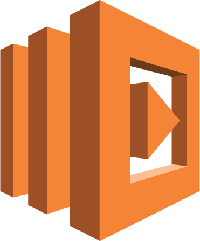
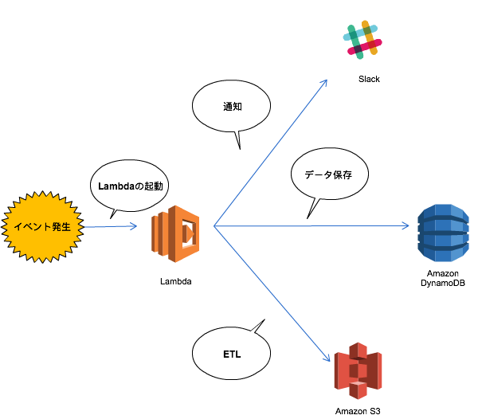

slidenumbers: true
autoscale: true
theme: Simple, 1

# [fit] Lambdaと上手に付き合う

### クラスメソッドのMEETUP
#### 〜プログラミングが好きだ！Python、Java、Ruby、Swiftをやってるエンジニア達が語るAWSどっぷりな会社での働き方〜
### 2017/05/16 中山 幸治

---
# 自己紹介

- 中山 幸治
- クラスメソッド AWS事業部 ソリューションアーキテクト
  - AWSを利用したインフラの設計/構築/コンサルティング
- GitHub: [knakayama](https://github.com/knakayama)
- 経歴
  - オンプレサーバの運用3年
  - AWS 1年


---
# アジェンダ

1. AWS Lambdaって何(1分)
1. AWS Serverless Application Modelって何(4分)
1. ソースコードはどうやって管理すべきか(4分)
1. Dockerと組み合わせる(4分)
1. まとめ(1分)

---
# 最近Node.jsお勉強中なのでそれを前提にしています<br/>(タイトルに入ってないですが…)

---
# あと多分時間足らない

---
# 1. Lambdaって何

---
# Lambdaの概要



- コードを実行できるコンピューティングサービス
  - サーバやプロセスを開発者側で管理する必要がない
  - → アプリケーションの抽象化
- リクエスト/実行時間に応じた従量課金制
  - → 基本的にEC2/ECSより安価になる場合が多い
- 現時点で公式サポートしている言語はNode.js/Python/Java/C#
  - → やろうと思えば別言語も実行可能
- Lambdaを中心としたシステムをサーバレスアーキテクチャと呼ぶ
  - → イベントドリブンに各種処理が実行されるという特徴がある

---
# イベントドリブンの例



---
# Lambdaのサンプル

```javascript
module.exports.handler = (event, context, callback) => {
  const response = {
    statusCode: 200,
    body: JSON.stringify({
      message: 'Hello, Lambda!',
    }),
  };
  callback(null, response);
};
// 結果 {"statusCode":200,"body":"{\"message\":\"Hello, Lambda!\"}"}
```

---
# 2. AWS Serverless Application Modelって何

---
# AWS Serverless Application Modelの概要


- サーバレスアーキテクチャを管理するためのモデル
  - 略してAWS SAMと呼ばれることが多い
- LambdaなどのAWSサービスを宣言的なコードとして管理可能
  - → アーキテクチャ全体をコードで管理できる
  - → Git/GitHubと連携してCI/CDパイプラインを作れる
- 実態はCloudFormationの拡張機能
  - → 学習コストが低い
- ローカルのソースコードからデプロイメントパッケージの作成/アップロードを自動化
- 専用のコマンドは用意されてないのでAWS CLIを利用する

---
# AWS Serverless Application Modelのサンプル

```yaml
---
AWSTemplateFormatVersion: 2010-09-09
Transform: AWS::Serverless-2016-10-31 # AWS SAMを利用することを明示的に指定
Description: Hello Lambda

Resources:
  Func1:
    Type: AWS::Serverless::Function # Lambda用リソースの定義
    Properties:
      CodeUri: src/handlers/func1 # ソースコードを含むディレクトリへのパス
      Handler: index.handler # ハンドラの指定(<ファイル名>.<関数名>)
      Runtime: nodejs6.10 # ランタイムの指定
```

---
# AWS Serverless Application Modelのデプロイ

```bash
# LambdaのコードなどをS3にアップロード(同時にテンプレートの変換)
$ aws cloudformation package \
  --template-file sam.yml \
  --s3-bucket <_YOUR_S3_BUCKET_> \
  --output-template-file .sam/packaged.yml \
# デプロイ(スタック/change setの作成/更新)
$ aws cloudformation deploy \
  --template-file .sam/packaged.yml \
  --stack-name <_YOUR_STACK_NAME_> \
  --capabilities CAPABILITY_IAM
```

---
# 3. ソースコードはどうやって管理すべきか

---
# AWS SAMでソースコードを管理する際の考え

- デプロイメントパッケージは最小にする
  - → Lambdaの起動時間を短縮するため
  - → AWS SAMはデプロイメントパッケージのinclude/excludeが弱いのでテストコードも分離
- 環境(開発/ステージング/本番)毎の差分を管理できるようにする
  - → `params` 以下に環境毎にパラメータを含んだ設定ファイルを用意
  - → `aws cloudformation deploy` の `--parameter-overrides` で環境毎のパラメータを吸収

---
# AWS SAMでソースコードを管理する際の考え

- リポジトリに全ての情報を含める
  - → `package.json` に必要なモジュールを全て入れる
  - → AWS CLIのラッパースクリプトを用意しておく
  - → ラッパースクリプトは直接実行させない(全て `npm` コマンド経由)
  - → `bin` 以下に配置して `package.json` の `scripts` から呼び出す

---
# これだ！

```bash
.
├── .sam # パッケージ化されたAWS SAMテンプレート(.gitignoreで除外)
│   └── packaged-dev.yml
├── bin # package.jsonのscriptsから呼び出すラッパースクリプト
│   └── deploy.sh
├── package.json # 必要なモジュールとラッパースクリプトの管理
├── params # 環境毎のパラメータ(ファイル形式は何でもよい)
│   └── param.dev.json
├── requirements.txt # AWS CLIもバージョン管理する
├── sam.yml # AWS SAMのテンプレート
```

---
# こうだ！

```bash
├── src # Lambda/API Gatewayなどのファイルを配置
│   ├── api # API Gateway用Swaggerファイル(使う場合)
│   │   └── swagger.yml
│   └── handlers # Lambdaのコードを設置
│       ├── func1 # デプロイメントパッケージ含ませるディレクトリ
│       │   ├── index.js # Lambdaのコード
│       │   ├── lib
│       │   │   └── func1.class.js # Lambdaの主要な機能はライブラリとして切り出す(テストしやすくする)
│       │   └── package.json # 非標準モジュールを使う場合(Lambda毎に作成する)
│       └── func2 # 別のLambda関数
│           └── index.js
└── test # テストコード
    ├── func1.spec.js
    └── func2.spec.js
```

---
# 4. Dockerと組み合わせる

---
# Dockerと組み合わせると嬉しいこと

- Lambdaの実態はAmazon Linuxベースのコンテナ
- 開発環境にMacを利用している場合にモジュールが動かない場合がある
  - → Node.jsのNative Addonとか
- Amazon LinuxのDockerイメージ経由でモジュールをインストールする
  - → `Dockerfile` でNode.jsとモジュールをインストール
  - → `docker run` の `-v` オプションで `node_modules` をローカルにマウント
- 本来はCI/CD環境上でパッケージインストールする仕組みを作るべき
  - → あくまでローカルの開発環境で利用する

---
[.footer: https://github.com/awslabs/serverless-image-resizing/blob/master/Dockerfile]

# Dockerfile

```docker
FROM amazonlinux

ADD etc/nodesource.gpg.key /etc
ADD package.json /tmp

WORKDIR /tmp

# Nodeのインストール
RUN yum -y install gcc-c++ && \
    rpm --import /etc/nodesource.gpg.key && \
    curl --location --output \
      ns.rpm https://rpm.nodesource.com/pub_6.x/el/7/x86_64/nodejs-6.10.1-1nodesource.el7.centos.x86_64.rpm && \
    rpm --checksig ns.rpm && \
    rpm --install --force ns.rpm && \
    npm install -g npm@latest && \
    npm cache clean && \
    yum clean all && \
    rm --force ns.rpm

# docker runしたときにpackage.jsonで指定したモジュールをインストールする
ENTRYPOINT npm install --production
```

---
# Dockerコマンド

```bash
# ECRの認証情報取得
$ aws ecr get-login
# ECRにログインしてAmazon LinuxのDockerイメージをpull/pushできるようにする
$ docker login -u AWS \
  https://<_YOUR_AWS_ACCOUNT_ID_>.dkr.ecr.<_YOUR_AWS_REGION_>.amazonaws.com
# イメージのビルド
$ docker build -t amazonlinux:nodejs .
# コンテナの実行(コンテナのnode_modulesをローカルにマウントする)
$ docker run --rm -v $PWD/node_modules:/tmp/node_modules amazonlinux:nodejs
```

---
# 5. まとめ

---
# まとめ

- Lambdaヤバイ
- サーバレスアーキテクチャは夢がある
- ハマるとヤバイ
- とはいえ全てのシステムにマッチするわけではない
- でもハマるとヤバイ
- AWSでアーキテクチャを考慮する際に一度は導入を検討してみては

---
# おわり
