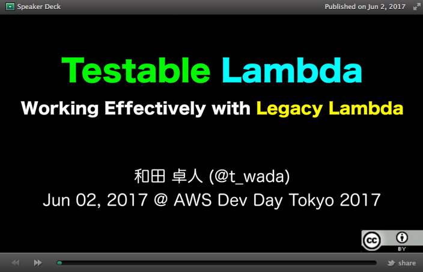

slidenumbers: true
autoscale: true
theme: Simple, 1

# AWS Serverless Application Modelのデプロイ戦略

### Developers.IO 2017
### 2017/07/01 中山 幸治

---
# 自己紹介

- 中山 幸治
- クラスメソッド AWS事業部 ソリューションアーキテクト
  - AWSを利用したインフラの設計/構築/コンサルティング
- GitHub: [knakayama](https://github.com/knakayama)
- 経歴
  - オンプレサーバの運用3年
  - AWS歴 1年半ぐらい


---
# アジェンダ

1. AWS Serverless Application Modelって何
1. 開発フローを考える
1. ソースコードはどう管理すべきか
1. CI/CDを整える
1. 今後の展望
1. まとめ

---
# 1. AWS Serverless Application Modelって何

---
# AWS Serverless Application Modelの概要


- サーバレスアーキテクチャを管理するためのモデル
  - 略してAWS SAMと呼ばれることが多い
- LambdaなどのAWSサービスを宣言的なコードとして管理可能
  - → アーキテクチャ全体をコードで管理できる
  - → Git/GitHubと連携してCI/CDパイプラインを作れる
- 実態はCloudFormationの拡張機能

---
# AWS SAMのテンプレート例

```yaml
---
AWSTemplateFormatVersion: 2010-09-09
Transform: AWS::Serverless-2016-10-31
Description: AWS SAM Sample

Resources:
  Func:
    Type: AWS::Serverless::Function
    Properties:
      CodeUri: path/to/func
      Handler: index.handler
      Runtime: nodejs6.10
      Events:
        Get:
          Type: Api
          Properties:
            Path: /users/{id}
            Method: get
            RestApiId: !Ref Api
  Api:
    Type: AWS::Serverless::Api
    ...
```

---
# AWS SAMのテンプレート例

```yaml, [.highlight: 3]
---
AWSTemplateFormatVersion: 2010-09-09
Transform: AWS::Serverless-2016-10-31 # AWS SAMを利用することを明示的に指定
Description: AWS SAM Sample

Resources:
  Func:
    Type: AWS::Serverless::Function
    Properties:
      CodeUri: path/to/func
      Handler: index.handler
      Runtime: nodejs6.10
```

---
# AWS SAMのテンプレート例

```yaml, [.highlight: 8]
---
AWSTemplateFormatVersion: 2010-09-09
Transform: AWS::Serverless-2016-10-31
Description: AWS SAM Sample

Resources:
  Func:
    Type: AWS::Serverless::Function # Lambda用リソースの定義
    Properties:
      CodeUri: path/to/func
      Handler: index.handler
      Runtime: nodejs6.10
```

---
# AWS SAMのテンプレート例

```yaml, [.highlight: 10]
---
AWSTemplateFormatVersion: 2010-09-09
Transform: AWS::Serverless-2016-10-31
Description: AWS SAM Sample

Resources:
  Func:
    Type: AWS::Serverless::Function
    Properties:
      CodeUri: path/to/func # Lambdaのソースコードを含むディレクトリへのパス
      Handler: index.handler
      Runtime: nodejs6.10
```

---
# AWS SAMのテンプレート例

```yaml, [.highlight: 11]
---
AWSTemplateFormatVersion: 2010-09-09
Transform: AWS::Serverless-2016-10-31
Description: AWS SAM Sample

Resources:
  Func:
    Type: AWS::Serverless::Function
    Properties:
      CodeUri: path/to/func
      Handler: index.handler # ハンドラの指定(<ファイル名>.<関数名>)
      Runtime: nodejs6.10
```

---
# AWS SAMのテンプレート例

```yaml, [.highlight: 12]
---
AWSTemplateFormatVersion: 2010-09-09
Transform: AWS::Serverless-2016-10-31
Description: AWS SAM Sample

Resources:
  Func:
    Type: AWS::Serverless::Function
    Properties:
      CodeUri: path/to/func
      Handler: index.handler
      Runtime: nodejs6.10 # ランタイムの指定
```

---
# AWS SAMのテンプレート例

```yaml
...
  Func:
    Type: AWS::Serverless::Function
    ...
      Events:
        Get:
          Type: Api # API Gatewayとのインテグレーション
          Properties:
            Path: /users/{id}
            Method: get
            RestApiId: !Ref Api
  Api:
    Type: AWS::Serverless::Api # API Gatewayリソースの定義
    ...
```

---
# AWS SAMとCLI


- ローカルのソースコードからデプロイメントパッケージの作成/アップロードができる
  - → 一度S3にアップロードしてからAWS SAMのテンプレートを変換するという動作
  - → 例えば `CodeUri` プロパティをS3へのパスに変換してくれる
- 専用のコマンドは用意されてないのでAWS CLIを利用する
  - → 厳密に言うとフレームワークではなくあくまでモデルという位置づけのため
  - → Serverless FrameworkやApexとは異なるポイント

---
# 変換されたAWS SAMのテンプレート例

```yaml, [.highlight: 10]
---
AWSTemplateFormatVersion: 2010-09-09
Transform: AWS::Serverless-2016-10-31
Description: AWS SAM Sample

Resources:
  Func:
    Type: AWS::Serverless::Function
    Properties:
      CodeUri: s3://<_S3_BUCKET_>/<_S3_PREFIX_>/<DEPLOYMENT_PACKAGE>
      Handler: index.handler
      Runtime: nodejs6.10
```
---
# AWS SAMのデプロイ

- 主に以下2つのコマンドを利用する
- `aws cloudformation package`
  - S3へのアップロードとテンプレートの変換
- `aws cloudformation deploy`
  - スタック/Change Setの作成 or 更新

---
# AWS SAMのデプロイ

```bash
$ aws cloudformation package \
  --template-file sam.yml \
  --s3-bucket <_S3_BUCKET_> \
  --s3-prefix <_S3_PREFIX_> \
  --output-template-file .sam/packaged.yml
```

```bash
$ aws cloudformation deploy \
  --template-file .sam/packaged.yml \
  --stack-name <_STACK_NAME_> \
  --capabilities CAPABILITY_IAM
```

---
# 2. 開発フローを考える

---
# 最低3つの環境を用意する

- Develop環境
  - → ローカルの開発環境
- Staging環境
  - → インテグレーションテストを実施する環境
  - → 基本的にProductionと同等の環境にしておくべき
- Production環境
  - → お客さんが実際に利用する環境

---
# Develop環境

- 日々発生する新機能開発やbugfixの修正を実施する環境
- 素早く開発するために開発者ローカルで完結できるようにする
- ローカル開発環境をサポートする環境を整える
  - → ベースはLocalstackなどのAWSエミュレーション系ツールで代替
  - → テストコードの中でAWS SDKのエンドポイントをlocalhostに変更
  - → とはいえ全ての機能を代替できないので適宜モック化

---


# [fit] t-wada氏のスライドが最高なので必ず読むこと

[.footer: https://speakerdeck.com/twada/testable-lambda-working-effectively-with-legacy-lambda]

---
# Staging/Production環境

- クラウドサービスという特性上、ローカルでのインテグレーションテスト or E2Eテストには限界がある
  - → エミュレーション系ツールはあくまで似た振る舞いをするだけなので、実際の動作と同じとは限らない
  - → あとモック書くのだるい
- Productionとほぼ同等の環境(Staging)の位置付けが重要
  - → Staging環境でテストするというのが現実解では

---
# ブランチ戦略

- GitHubフロー + リリースブランチ方式
- 開発時は普通にGitHubフローを利用
- Staging/Productionにリリースする際にブランチを切り替える
- リリースブランチはデプロイが伴うので間違ってpushさせないようにする
  - → Protected Branchを利用

---
# ブランチ戦略

| ブランチ名                    | 用途                                              |
|-------------------------------|---------------------------------------------------|
| `master`                      | チェックアウト元となるブランチ                    |
| 任意( `add-new-feature` とか) | masterからチェックアウトしたトピックブランチ      |
| `staging`                     | staging用リリースブランチ<br/>Protected Branch    |
| `production`                  | production用リリースブランチ<br/>Protected Branch |

---
# ブランチのライフサイクル

1. `master` からトピックブランチ作成
1. `master` に対してWIP PR出す
1. 開発
1. `master` にPRのレビュー依頼&マージ
1. テストのタイミングで `master` から `staging` にPR & マージ
1. `staging` でインテグレーションテスト
1. リリースのタイミングで `staging` から `production` にPR & マージ

---
# 3. ソースコードはどう管理すべきか

---
# デプロイメントパッケージを小さくする

- デプロイメントパッケージは必要なもの以外含まない
  - → Lambdaのコールドスタートを短縮するため
- AWS SAMはデプロイメントパッケージの取捨選択が弱いのでテストコードも分離
  - → つまりLambdaのソースコードと同じディレクトリには含めない
  - → Serverless Frameworkはワイルドカードで柔軟に選択できるのだが…

[.footer: https://speakerdeck.com/keisuke69/quan-bu-jiao-emasu-saharesuahurifalseantihatantotiyuninku?slide=24]

---
# 1つのコードベースと複数環境への対応

- 環境毎にスタックを分離する
  - → AWS SAMは現時点でLambdaのVersion & Aliasと相性悪い
  - → `aws cloudformation deploy` の `--stack-name` で環境毎にスタックを分離する
- 環境毎に異なるパラメータを設定ファイルで管理
  - → `params` 以下に環境毎のパラメータを含んだ設定ファイルを用意
  - → `aws cloudformation deploy` の `--parameter-overrides` で環境毎のパラメータを吸収

---
# リポジトリで完結させる

- リポジトリに全ての情報を含める
  - → 複数人での開発でも同じ環境をすぐに再現できるようにしておく
  - → `package.json`に必要なモジュールを全て入れる
- AWS CLIのラッパースクリプトを用意しておく
  - → AWS SAMを利用しているとAWS CLIを頻繁に利用するため
  - → ラッパースクリプトを `bin` 以下に配置して `package.json` の `scripts` から呼び出す
  - → `npm` or `yarn` で実行
  - → AWS CLIのバージョンも `requirements.txt` で管理

---
# 僕が考えた最強のディレクトリ構造

| ディレクトリ or ファイル名 | 役割                                                                                                                                     |
|----------------------------|------------------------------------------------------------------------------------------------------------------------------------------|
| `.sam/`                    | `aws cloudformation package` で変換されたテンプレート( `.sam/packaged.yml` など)<br/> 同じファイルを再生成可能なので `.gitignore` で除外 |
| `bin/`                     | AWS CLIのラッパースクリプト( `bin/deploy.sh` など)                                                                                       |
| `package.json`             | モジュールとラッパースクリプトの管理                                                                                                     |
| `params/`                  | 環境毎のパラメータ( `params/stg.json` など)                                                                                              |
| `requirements.txt`         | AWS CLIのバージョン管理                                                                                                                  |
| `sam.yml`                  | AWS SAMのテンプレート                                                                                                                    |

---
# 僕が考えた最強のディレクトリ構造

| ディレクトリ or ファイル名 | 役割                                                                                                                               |
|----------------------------|------------------------------------------------------------------------------------------------------------------------------------|
| `src/`                     | LambdaのソースコードやAPI GatewayのSwaggerファイル置き場<br/> `sam.yml` とは異なるテンプレートを利用したい場合はここに置くのもあり |
| `src/api/swagger.yml`      | API GatewayのSwaggerファイル(使う場合)                                                                                             |
| `src/handlers/<関数名>/`   | Lambdaのソースコード置き場                                                                                                         |
| `test/`                    | テストコード置き場( `test/<関数名>.spec.js` など)                                                                                  |
| `yarn.lock`                | yarnのロックファイル(使う場合)                                                                                                     |
| `buildspec.yml`            | CodeBuildの設定ファイル                                                                                                            |

---
# 4. CI/CDを整える

---
# AWS SAMとCI/CD

- AWS SAMでCI/CDするためのツール or サービスはいろいろある
  - → Jenkins/CircleCI/Travis CI/etc...
- 今回はCodePipelineとCodeBuildの組み合わせをご紹介
  - → 各種AWSサービスとの連携が手厚い印象
- ただし、やろうとしている内容的にどのツール or サービスでもできるので何でもよいのでは

---
# CodePipeline


- CI/CDのパイプライン(フロー)を管理できるマネージドサービス
  - → ソースソードの取得/ビルド/テストというパイプラインを整理できる
- パイプライン上の各サービスはステージと呼ぶ
  - → ステージで生成されたアーティファクトはS3に配置することによりステージ間で連携する
- ソースコードの取得先としてGitHubを利用可能
  - → 注意点としてブランチへのpushを契機とする必要あり
  - → 現時点ではタグに未対応
- CodePipelineからCloudFromationの実行/Change Set作成/更新などが可能

---
# CodeBuild


- `buildspec.yml` に基づきビルド/テストを実施できるマネージドサービス
  - → フェーズという概念で特定のタイミングで任意のコマンドを実行可能
  - → `circle.yml` と大体同じ
- サービスロールに対応しているのでAWSクレデンシャルの発行が不要
  - → CI/CD SaaSと異なる利点

---
# CI/CDパイプライン - 全体

1. staging/productionブランチへのマージを契機にCodePipeline実行
1. GitHubからソースコード取得
1. CodeBuildでビルド & テスト
1. CodePipelineからCloudFormationの実行

[.footer: http://dev.classmethod.jp/cloud/aws/developing-cloudformation-ci-cd-pipeline-with-github-codebuild-codepipeline/]

---
# CI/CDパイプラン - Source

- CodePipelineが担当
- GitHubからソースコードを取得してS3に保存

---
# CI/CDパイプラン - Build & Test

- CodeBuildが担当
- 最初にS3からソースコードを取得
- テストはユニットテスト
- この場合のビルドとは `aws cloudformation package` を指す
- 生成したアーティファクトをS3に保存

---
# buildspec.ymlの例

```yaml
version: 0.2

phases:
  install:
    commands:
      - |
        # AWS CLI
        pip install -U pip
        pip install -r requirements.txt

        # yarn
        curl -sS https://dl.yarnpkg.com/debian/pubkey.gpg | sudo apt-key add -
        echo "deb http://dl.yarnpkg.com/debian/ stable main" | sudo tee /etc/apt/sources.list.d/yarn.list
        sudo apt-get update
        sudo apt-get install -y yarn
        yarn
  pre_build:
    commands:
      - |
        [ -d .sam ] || mkdir .sam
        aws cloudformation validate-template --template-body file://sam.yml
        yarn test
  build:
    commands:
      - |
        aws cloudformation package \
          --template-file sam.yml \
          --s3-bucket $S3_BUCKET \
          --s3-prefix $S3_PREFIX \
          --output-template-file .sam/packaged.yml

artifacts:
  files:
    - .sam/*
    - params/*
  discard-paths: yes
```

---
# buildspec.ymlの例 - 環境のセットアップ

- CodeBuildにバンドルされている `pip` のバージョン古い
- 思わぬエラーが発生しがちなのでバージョン上げておくこと

```yaml
  install:
    commands:
      - |
        # AWS CLI
        pip install -U pip
        pip install -r requirements.txt

        # yarn
        curl -sS https://dl.yarnpkg.com/debian/pubkey.gpg | sudo apt-key add -
        echo "deb http://dl.yarnpkg.com/debian/ stable main" | sudo tee /etc/apt/sources.list.d/yarn.list
        sudo apt-get update
        sudo apt-get install -y yarn
        yarn
```

---
# buildspec.ymlの例 - テスト

- AWS SAMテンプレートのバリデーションとユニットテスト
- `post_build` でやってもいい

```yaml
  pre_build:
    commands:
      - |
        [ -d .sam ] || mkdir .sam
        aws cloudformation validate-template --template-body file://sam.yml
        yarn test
```

---
# buildspec.ymlの例 - ビルド

- 後でロールバックさせたい時のために `S3_PREFIX` を日付などにしておくとよい

```yaml
  build:
    commands:
      - |
        aws cloudformation package \
          --template-file sam.yml \
          --s3-bucket $S3_BUCKET \
          --s3-prefix $S3_PREFIX \
          --output-template-file .sam/packaged.yml
```

---
# buildspec.ymlの例 - アーティファクトの生成

- 変換されたAWS SAMテンプレートと環境毎のパラメータをアーティファクトとしてS3にアップロード
- `discard-paths` はディレクトリ名を無視してアップロードするかどうか(お好みでOK)

```yaml
artifacts:
  files:
    - .sam/*
    - params/*
  discard-paths: yes
```

---
# CI/CDパイプラン - Change Setの作成

- CodePipelineが担当
- S3からアーティファクトを取得
- Templateに変換されたAWS SAMテンプレートを指定
- Template Configurationに環境毎のパラメータファイルを指定

```json
{
  "Parameters": {
    "Env": "stg",
    "ReadCapacityUnits": "10",
    "WriteCapacityUnits": "10"
  }
}
```

---
# CI/CDパイプラン - SNSトピックへの通知

- CodePipelineが担当
- Change Setの内容を確認
- SNSトピックをサブスクライブしたLambdaからSlackなどに通知することも可能

---
# CI/CDパイプラン - Change Setの実行

- CodePipelineが担当
- Stack Nameに環境毎のスタック名を指定する
- Change Setを実行してパイプライン完了

---
# 5. 今後の展望

---
# 今後の展望

- サーバレスアーキテクチャでデプロイする環境は確立されてきた印象
  - → AWS SAM/Serverless Frameworkなど周辺ツールの充実
- ただインテグレーションテスト or E2Eテストを含めたCIの部分で知見が少ない
  - → Localstack使うとCI上でもインストールしないといけない
  - → ユーザ事例やベストプラクティスがまだ少ない
- ローカル開発環境を充実させたい
  - → Localstackは今年発表されたのでまだまだ機能不足な印象
  - → モック書くのシンドい

---
# 6. まとめ

---
# [fit] サーバレスアーキテクチャ最高


---
# おわり
