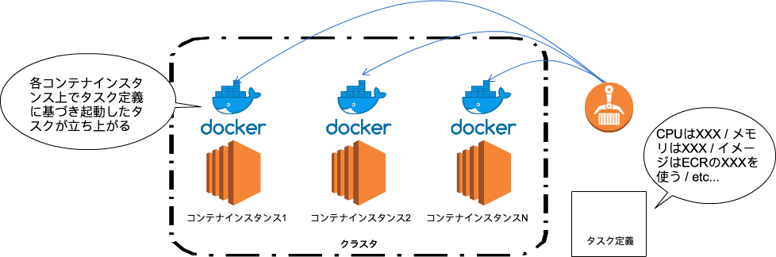
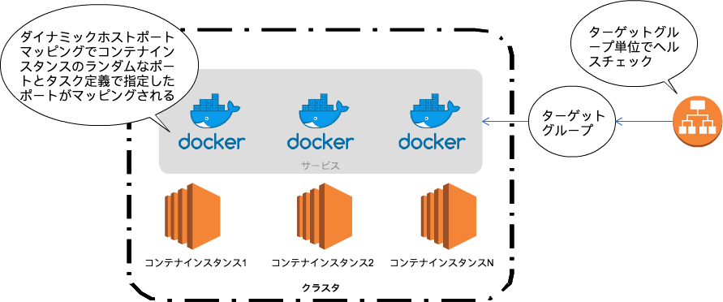
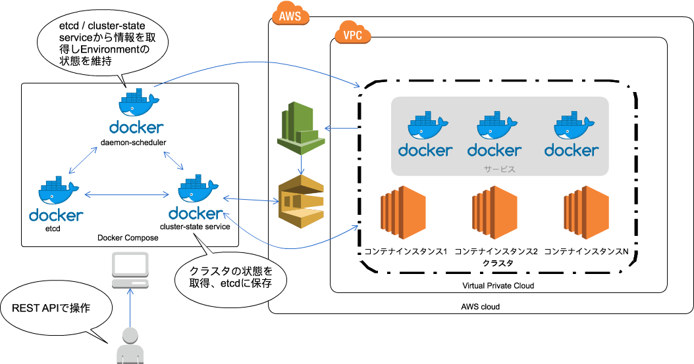
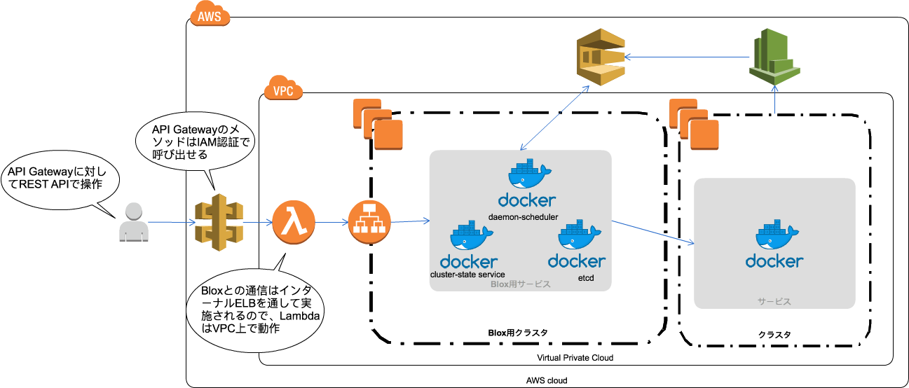
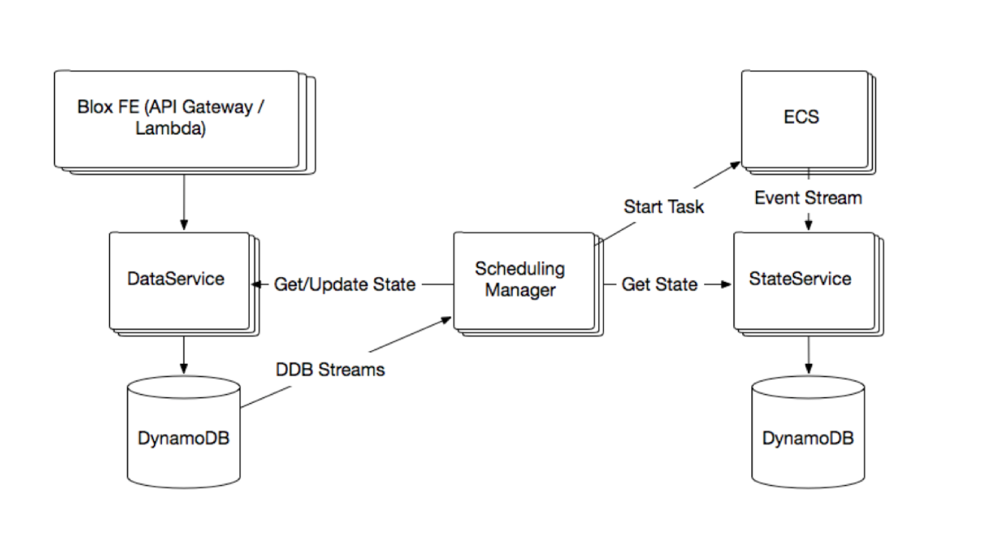
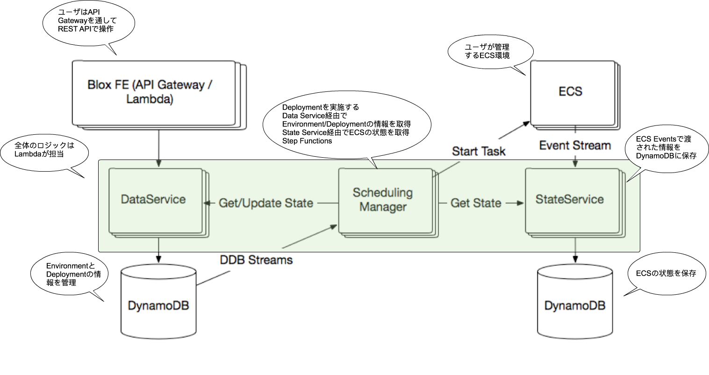

slidenumbers: true
autoscale: true
theme: Simple, 1

# Bloxが切り開くECSの世界

### 第二回 合同勉強会 in 福岡 #gbfukuoka
### 2017/08/26 中山 幸治

---
# 自己紹介

- 中山 幸治
- クラスメソッド モバイルアプリサービス部 AWSソリューションアーキテクト
  - AWSを利用したインフラの設計/構築
- GitHub: [knakayama](https://github.com/knakayama)
- 経歴
  - オンプレサーバの運用3年
  - AWSやりたかったのでクラスメソッドに転職
  - 最近モバイルアプリサービス部へ異動


---
# アジェンダ

1. ECSのおさらい
1. Bloxの話
1. まとめ

---
# 本日のゴール

- ECS/Bloxについて知る
- ~~Bloxの存在感が薄いので~~ ECSを使う上でBloxという選択肢が存在することを知る
- 次期リリースに向けBloxは確実に進化しているのでその期待感を共有する

---
# 1. ECSのおさらい

---
# その前に<br/>そもそもなんでECS使うのか

---
# サーバレスじゃだめなんですか 🤔

---
# サーバレス is

- ハマる時には最高 😊
- でも向き不向きありますよね
  - フレームワーク使いたいんですけど
  - RDS使いたいんですけど
- どうしても制限が…
  - マネージドサービスなのでユーザ側でできることが限られる
- 全部Lambda先生にお願いできたら最高だけど銀の弾丸はない

---
# Elastic Beanstalkは :innocent:

---
# ECSのうれしいところ

- ユーザで管理できる部分とAWSにおまかせできる部分の塩梅がよい
  - Dev目線
      - コンテナで動作させるソースコードとDockerfileを管理すればいい
  - Ops目線
      - デプロイが楽 → イメージ作ってデプロイすればECSがよしなにやってくれる
      - CloudFormationで管理できるところもよい
- 内部的にEC2使ってるのでユーザ側でリソース増やせる
  - Lambda/API Gatewayだったらどうなる？
- ECS自体は無料

---
# ECS概要


- AWSでDockerコンテナを管理するためのマネージドサービス
  - Dockerコンテナを何処に/どうやって配置させるのか
- 他AWSサービスと連携してコンテナを管理できる
  - Auto Scaling Group/CloudFormation/CloudWatch/etc...
- ECS自体は無料で利用可能
  - 他のAWSサービスに対する課金
  - 主にEC2/S3

---
# ECSのおさらい(その1)

- コンテナインスタンス
  - Amazon ECS container agentが動作するEC2インスタンス
  - コンテナインスタンス上でDockerコンテナが動作する
  - 一般的にはAmazon ECS container agentがインストールされたECS-optimized AMIから起動させる
  - 基本的にDockerコンテナが利用するリソースのプールとして考えて良い
- クラスタ
  - 1つ以上のコンテナインスタンス郡
  - Dockerコンテナはクラスタ内のリソース(CPU/メモリなど)を利用して実行される

---
# ECSのおさらい(その2)

- タスク定義
  - どういった設定でDockerコンテナを起動させるかの定義
  - どのイメージからDockerコンテナを起動させるか
  - どの程度クラスタ内のリソース(CPU/メモリ)を使えるか
  - etc...
- タスク
  - タスク定義に基づき起動したDockerコンテナ

---
# ECSのおさらい(その3)

- ECR(Elastic Container Registry)
  - IAMに基づきアクセス制御可能なマネージドプライベートリポジトリ
  - 一般的にECSで独自のイメージを利用する場合はECRを使う
  - 保存したイメージサイズに応じて課金される
  - 内部的にS3が利用されている

---
# 図にするとこんな感じ



---
# ECSの主要な概念(その4)

- サービス
  - ECSにおけるスケジューラ(と考えても大きくハズレてない)
  - サービスを通してタスクを起動させることでタスクを期待した状態にスケジューリングしてくれる
  - いくつタスクを起動させるか/どのコンテナインスタンスにタスクを配置するかなど
- タスク配置戦略/タスク配置制限
  - サービスから起動するタスクをどういったルールでクラスタ上に配置するか
  - クラスタのリソース消費量が最小になるようにしたい(タスク配置戦略)
  - 高いインスタンスタイプのコンテナインスタンスにのみ配置させたい(タスク配置制限)
  - 他にも細かく指定可能

---
# ECSの主要な概念(その5)

- ターゲットグループ(厳密にはALBの概念)
  - ALBからタスクにトラフィックをルーティングするための単位
  - ターゲットグループはサービスと関連付けされ各タスクにトラフィックが流れる
  - ALBはターゲットグループへのヘルスチェックを通してサービスディスカバリを実現する
- ダイナミックホストポートマッピング
  - コンテナインスタンスとタスクで利用するポートを動的にマッピングしてくれる機能
  - これがないと同じポートを利用するタスクが同一コンテナインスタンスで起動できない
  - CLBは対応してない

---
# 図にするとこんな感じ



---
# ECSの主要な概念(その6)

- ECS Events
  - ECS内の状態に変化が起きた場合にCloudWatch Eventsへさまざまなイベントを送ってくれる
  - コンテナインスタンス/タスクが起動 or 停止した/etc...
  - 他のAWSサービスをターゲットにすることでイベントドリブンに処理が可能
  - Slackに通知する/新しいタスクを起動させる/etc...

---
# 2. Bloxの話

---
# Blox概要


- ECSで動作するコンテナのカスタムスケジューラ
  - ECS単体では難しいスケジューリングを実現できる
- 2016年のre:Inventで発表された
- Apache2.0のオープンソースプロジェクト
- v0.3.0とv1.0が存在
  - 現在v1.0へ絶賛移行中
  - v1.0はまだ正式リリースされてない

[.footer: https://github.com/blox/blox]

---
# v0.3.0とv1.0の違い

- v0.3.0はソースコード公開したからみんなで開発していこうぜという感じ
  - Go実装
  - Blox用の環境を自分で作る必要がある
  - **Deprecated**
- v1.0はマネージドサービスを目指している
  - つまり **ECSの機能として提供される** (予定)
  - マネジメントコンソール/CLI/SDKsから操作可能(予定)
  - Java実装

[.footer: https://github.com/blox/blox/blob/dev/FAQ.md]

---
# v0.3.0とv1.0ではだいぶ違うので<br/>分けて説明します

---
# その前になぜカスタムスケジューラが必要なのか 🤔

---
# ECSはすでに主要なスケジューリング方式をサポートしている

---
# タスク配置戦略

| 戦略      | 意味                                                              |
|-----------|-------------------------------------------------------------------|
| `binpack` | クラスタのCPU/メモリ消費量が最小となるようにタスクを配置          |
| `random`  | クラスタにタスクをランダムで配置                                  |
| `spread`  | 指定した属性 / `instanceId` / `host` が均等になるようタスクを配置 |

[.footer: http://docs.aws.amazon.com/AmazonECS/latest/developerguide/task-placement-strategies.html]

---
# タスク配置制限

| 制限               | 意味                                                               |
|--------------------|--------------------------------------------------------------------|
| `distinctInstance` | タスクが異なるコンテナインスタンスに配置されるよう制限             |
| `memberOf`         | Cluster Query Languageで表現した式を満たすようにタスクの配置を制限 |

[.footer: http://docs.aws.amazon.com/AmazonECS/latest/developerguide/task-placement-constraints.html]

---
# その他

- サービスのDesired Countで希望するタスク数を維持
- ALB/CLBのヘルスチェックを利用したサービスディスカバリ
- CloudWatch Metricsに基づいたサービスのオートスケーリング
- `RunTask` or `StartTask` APIで任意のタイミングでタスクを起動
- cron形式で特定の時間にタスクを起動

[.footer: http://docs.aws.amazon.com/AmazonECS/latest/developerguide/scheduling_tasks.html]

---
# デフォルトのスケジューラでは要件を満たしにくい場合

- クラスタの状態に応じたイベントドリブンなタスクの配置
  - コンテナインスタンスが起動/停止したらタスクも起動/停止する
- より複雑なヘルスチェックに基づいたタスクの配置
  - ALBはHTTP(S)レベルのヘルスチェックしかできない
  - CLBではスケールしにくい(ダイナミックホストポートマッピングに未対応なので)

---
# Bloxによって期待できること

- カスタムスケジューラを開発していく基盤となり得る
  - 既存AWSサービスを組み合わせて独自にスケジューラを作成することは可能
  - しかしいちいち自分で仕組みを作り込む必要がある
- オープンソースにすることによりコミュニティベースで開発できる
  - 他の人が作ったスケジューラを導入するみたいなこともできる日が来るかも
- ECSの機能の中でカスタマイズできる
  - Kubernetesもいいけど巨人(AWS)の肩に乗りたい

---
# 正直にいうとデフォルトスケジューラで要件満たせない環境に遭遇したことはまだない :innocent:

---
# v0.3.0について

---
# v0.3.0の概要

- クラスタの状態管理とサンプルとなるスケジューラが同梱
  - cluster-state service → 状態管理
  - daemon-scheduler → スケジューラ
- これらをREST APIで操作可能
- ローカルPC/AWSにデプロイ可能
- Dockerイメージも用意してくれている
  - 自分でGoをコンパイルすることも可能だがコンテナで動かすとお手軽
- 環境を構築するためのサンプルCloudFormationテンプレートもある
- Deprecatedだが概念自体はv1.0と似ているので参考になる

---
# cluster-state service

- クラスタの状態をリアルタイムに管理
  - クラスタに新しいコンテナインスタンス/タスクが起動 or 停止したなど
  - これらの情報をetcdに保存
  - cluster-state serviceの情報を利用して自分の環境に合ったスケジューラが実装可能
  - 単体ではクラスタの状態管理しかしない
- リアルタイムの情報収集にECS Eventsを利用している
  - ECS Eventsのターゲットに指定されたSQSからメッセージを取得してetcdに保存
- CloudWatch Events/SQS/etcdは別途用意する必要あり

[.footer: https://github.com/blox/blox/tree/v0.3/cluster-state-service]

---
# deamon-scheduler

- コンテナインスタンス毎に1つのタスクを配置するスケジューラ
- 監視/ログ収集系のタスク(Datadog/Fluentdなど)を管理するために使える
  - 各コンテナインスタンス毎にタスクが起動している必要があるため
- 内部的にcluster-state serviceを利用している
  - リファレンスモデルという位置付け
- クラスタに新しいコンテナインスタンスが登録されたらタスクを起動させる
- 逆にコンテナインスタンスが削除されたらタスクも削除する

[.footer: https://github.com/blox/blox/tree/v0.3/daemon-scheduler]

---
# daemon-schedulerの主要な概念

- Environment
  - タスク定義とクラスタをひも付けた情報
  - Environmentの状態をdaemon-schedulerが維持しようとしてくれる
  - Environmentはあくまで情報であり以下のDeploymentを実施して始めてECSにタスクが起動する
- Deployment
  - Environmentをクラスタ上にデプロイする操作
  - Deploymentを通してEnvironmentがクラスタ上に展開される

[.footer: https://github.com/blox/blox/tree/v0.3/daemon-scheduler]

---
# v0.3.0のアーキテクチャ(ローカルPC)



[.footer: ※ コンテナで動作させた場合]

---
# v0.3.0のアーキテクチャ(AWS)



[.footer: ※ コンテナで動作させた場合]

---
# cluster-state serviceのREST API

| Path(Base Pathは `/v1`)      | Method | 処理                                                            |
|------------------------------|--------|-----------------------------------------------------------------|
| `/instances`                 | GET    | 全てのコンテナインスタンスを表示                                |
| `/tasks`                     | GET    | 全てのタスクを表示                                              |
| `/instances/{cluster}/{arn}` | GET    | `{cluster}` 内の `{arn}` で指定されたコンテナインスタンスを表示 |
| `/tasks/{cluster}/{arn}`     | GET    | `{cluster}` 内の `{arn}` で指定されたタスクを表示               |
| `/stream/instances`          | GET    | パスパラメータで指定されたインスタンスの情報をストリームで表示  |
| `/stream/tasks`              | GET    | パスパラメータで指定されたタスクの情報をストリームで表示        |

[.footer: https://github.com/blox/blox/blob/v0.3/cluster-state-service/swagger/v1/swagger.json]

---
# deamon-schedulerのREST API

| Path(Base Pathは `/v1`)                 | Method | 処理                                                                                   |
|-----------------------------------------|--------|----------------------------------------------------------------------------------------|
| `/ping`                                 | GET    | HTTPステータスコード200を返答                                                          |
| `/environments`                         | GET    | 全てのEnvironmentを表示                                                                |
| `/environments`                         | POST   | Environmentを作成                                                                      |
| `/environments/{name}`                  | GET    | `{name}` で指定されたEnvironmentを表示                                                 |
| `/environments/{name}`                  | DELETE | `{name}` で指定されたEnvironmentを削除                                                 |
| `/environments/{name}/deployments`      | GET    | `{name}` で指定されたEnvironmentに設定されている全てのDeploymentを表示                 |
| `/environments/{name}/deployments`      | POST   | `{name}` で指定されたEnvironmentに対してDeploymentを作成                               |
| `/environments/{name}/deployments/{id}` | GET    | `{name}` で指定されたEnvironmentに設定されている `{id}` という識別子のDeploymentを表示 |

[.footer: https://github.com/blox/blox/blob/v0.3/daemon-scheduler/swagger/v1/swagger.json]

---
# Environmentの情報

```bash
$ curl -s 127.0.0.1:2000/v1/environments/test | jq
{
  "deploymentToken": "c6f05550-0c2a-42b9-aa81-f66c3c60853e",
  "health": "healthy",
  "instanceGroup": {
    "cluster": "arn:aws:ecs:ap-northeast-1:111122223333:cluster/blox2"
  },
  "name": "test",
  "taskDefinition": "arn:aws:ecs:ap-northeast-1:111122223333:task-definition/nginx:37"
}
```

---
# Deploymentの情報

```bash
$ curl -s 127.0.0.1:2000/v1/environments/test/deployments | jq
{
  "items": [
    {
      "environmentName": "test",
      "failedInstances": [],
      "id": "95d3644f-3624-4324-81fe-35d50583f420",
      "status": "completed",
      "taskDefinition": "arn:aws:ecs:ap-northeast-1:111122223333:task-definition/nginx:37"
    }
  ]
}
```

---
# v1.0について

---
# 以下の情報は2017/08/26時点のものなので今後変わる可能性がある点に注意してください

---
# v1.0の概要

- AWS上で動作するECSのマネージドカスタムスケジューラ
- ECSの機能として提供されるのでユーザはBloxを事前に構築する必要がない
  - 一応ユーザのAWS環境でも動かせるので独自にカスタマイズすることも可能
- まだ設計に関するドキュメントがあるだけで実装はほとんどできてない
- v0.3.0と同じようにまずはdaemon-schedulerを実装
  - 今後他のスケジューラを追加していく予定
- ECSのソースコードの一部をApache 2.0で公開している？
  - v1.0の位置付けが正直よく分からない :innocent:

[.footer: https://github.com/blox/blox/blob/dev/FAQ.md]

---
# v1.0のdaemon schedulerアーキテクチャ



[.footer: https://github.com/blox/blox/blob/dev/docs/daemon_infrastructure.md#architecture]

---
# v1.0のdaemon schedulerアーキテクチャ



---
# Blox frontend

- Bloxを操作するためのHTTPエンドポイント
- API GatewayとLambdaから構成される
  - AWS Proxyで登録されたLambdaが実際の処理を実施
  - InvokeされたLambdaはData Serviceを呼び出しDynamoDBへデータを保存
  - メソッド毎に別のLambdaにするのではなく全部1つのLambdaで処理させる
- API GatewayとはIAMで認証する
- ユーザはBlox frontendを通してREST APIで操作する

[.footer: https://github.com/blox/blox/blob/dev/docs/frontend_design.md]

---
# Data Service

- Environment/Deploymentの情報を保存/取得する際に呼び出されるAPI
- 各コンポーネントはDynamoDBを直接参照するのではなくこのAPIを通してデータにアクセスする

[.footer: https://github.com/blox/blox/blob/dev/docs/daemon_design.md#data-service]

---
# DynamoDB

- v0.3.0とは異なりデータストアとしてDynamoDBを利用する
- Data Service用テーブル
  - EnvironmentとDeploymentの状態を保存
- State Service用テーブル
  - ECSの状態を保存
- Data Service用テーブルのDynamoDB Streams経由でScheduling Managerを呼び出しDeploymentを実施

---
# Scheduling Manager

- Deploymentを実施してタスクをコンテナインスタンス上に配置
- Step Functionsから起動されたLambdaで実施する
  - 今後Scheduler(Scheduling Controller)部分は切り出す予定
- Data Serviceを呼び出してEnvironment/Deploymentの状態を取得/保存する
- State Serviceを呼び出してECSの状態を取得/保存する

[.footer: https://github.com/blox/blox/blob/dev/docs/daemon_design.md#scheduling-manager]

---
# State Service

- ECS Eventsで渡された情報をDynamoDBに保存するLambdaから構成される
- ECSの状態に変化が起きた場合にリアルタイムで処理することが可能
  - 同時にScheduled CloudWatch EventsからInvokeされたLambda経由でクラスタの状態を取得するらしい
- ただECS Eventsで機能が足りるのか悩んでるっぽい
  - ECS Eventsはすべての情報を伝達してくれるわけではない
  - イベントを取りこぼす可能性がある
  - ユーザのECSからAWSアカウント側(マネージドBloxが構築されるアカウント)へイベントをどうやって送るのか

[.footer: https://github.com/blox/blox/blob/dev/docs/daemon_design.md#state-service]

---
# daemon schedulerのAPI

| API                  | 処理                    |
|----------------------|-------------------------|
| `CreateEnvironment`  | 新しいEnvironmentを作成 |
| `StartDeployment`    | 新しいDeploymentを作成  |
| `RollbackDeployment` | 以前のDeploymentに戻す  |
| `StopDeployment`     | Deploymentを停止する    |
| `UpdateEnvironment`  | Environmentを更新       |
| `DeleteEnvironment`  | Environmentを削除       |
| `GetEnvironment`     | 特定のEnvironmentを表示 |
| `ListEnvironments`   | 全てのEnvironmentを表示 |
| `GetDeployment`      | 特定のDeploymentを表示  |
| `ListDeployments`    | 全てのDeploymentを表示  |

[.footer: https://github.com/blox/blox/blob/dev/docs/daemon_design.md#user-experience]

---
# v1.0のEnvironmentはこんな感じで使える？

```bash
# Environmentを作成
$ aws ecs create-environment \
  --name <name> \
  --task-definition <task-definition> \
  --instance-group <instance-group> \
  --role <role> \
  --deployment-configuration <deployment-configuration>
# 全てのEnvironmentを表示
$ aws ecs list-environments \
  --environment-type <environment-type>
# 特定のEnvironmentを表示
$ aws ecs get-environment \
  --environment-name <environment-name>
```

[.footer: https://github.com/blox/blox/blob/dev/docs/daemon_design.md#user-experience]

---
# v1.0のDeploymentはこんな感じで使える？

```bash
# Deploymentを作成
$ aws ecs start-deployment \
  --environment-name <environment-name> \
  --environment-version <environment-version>
# 全てのDeploymentを表示
$ aws ecs list-deployments \
  --environment-name <environment-name>
# 特定のDeploymentを表示
$ aws ecs get-deployment \
  --environment-name <environment-name> \
  --deployment-id <deployment-id>
```

[.footer: https://github.com/blox/blox/blob/dev/docs/daemon_design.md#user-experience]

---
# 3. まとめ

---
# 3行で

- サーバレスでは難しいとなったらECSは良い選択肢
- ECSをよりパワフルにする機能としてBloxがある
- Blox v1.0はマネージドサービスを目指している

---
# おわり
