slidenumbers: true
autoscale: true
theme: Simple, 1

# サーバーレス x IoT<br/>〜我々はどういった課題に直面してそれをどのように解決したのか〜
### AWS Deep Night Part.2<br/>2018/04/05 中山 幸治

---
# 自己紹介

- 中山 幸治
- クラスメソッド モバイルアプリサービス部
  - AWSソリューションアーキテクト
  - サーバーサイドエンジニア
- GitHub: [knakayama](https://github.com/knakayama)
- 経歴
  - オンプレサーバの運用3年
  - AWS 2年


---
# セッション内容について

- 自分が関わっている案件で発生した課題とその解決方法について話します
- 特にAWS IoTとサーバーレスアプリケーションにフォーカスしています
- IoTデバイスのハードウェアよりな内容は話しません、というかできない 😇
- 資料公開します

---
# アジェンダ

1. どういった技術を使っているのか
1. アプリからIoTデバイスの操作に失敗する問題
1. 通知したい間隔がずれる問題
1. AWS IoTのテストどうするか問題

---
# アジェンダ

1. どういった技術を使っているのか 👈
1. アプリからIoTデバイスの操作に失敗する問題
1. 通知したい間隔がずれる問題
1. AWS IoTのテストどうするか問題

---
# アーキテクチャ概要

- 管理者用ページはCloudFront + S3でSPA、エンドユーザはモバイルアプリ
- バックエンドAPIはAPI Gateway + Lambda + DynamoDB
- Cognito + API Gatewayのカスタムオーソライザを利用した認証/認可
- IoTデバイスはAWS IoTにデータをPublish、Device Shadow経由でデバイスを操作
- Kinesis Data Streams + Lambdaを利用してS3に分析用データ保存

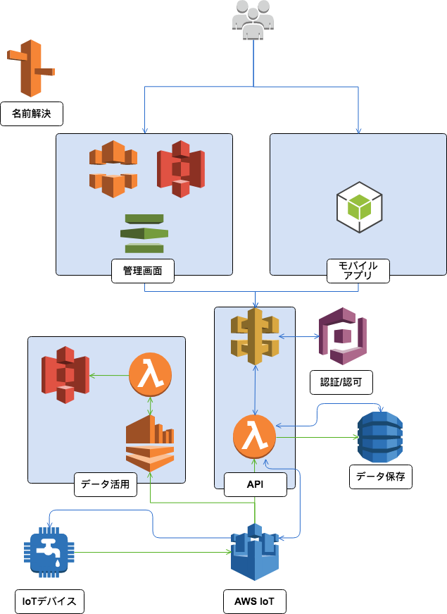

---
# もう少しご紹介すると

- Lambda関数のランタイムはPython
- 構成管理はCloudFormation/AWS SAM
- CI/CDにCircleCIを利用している[^1]
- Lambda関数のログ管理はLogentries[^2]
- メトリクスはDatadogで監視

[^1]: https://dev.classmethod.jp/server-side/serverless/practical-ci-cd-with-aws-sam-circleci-and-localstack/

[^2]: https://dev.classmethod.jp/devops/managing-logentries-token-with-terraform-and-ssm-parameter-store/

---
# アジェンダ

1. どういった技術を使っているのか
1. アプリからIoTデバイスの操作に失敗する問題 👈
1. 通知したい間隔がずれる問題
1. AWS IoTのテストどうするか問題

---
# Device Shadowとは

> "デバイスの現在の状態情報の保存と取得に<br/>使用されるJSONドキュメントです。"[^3]
> <br/><br/>
> "AWS クラウドでのデバイスの永続表現を可能にします。更新された状態情報をデバイスシャドウにパブリッシュしておくと、デバイスは接続時に自らの状態を同期させることができます。また、デバイスは現在の状態をアプリケーションや別のデバイス用にシャドウにパブリッシュすることもできます。"[^3]

[^3]: https://docs.aws.amazon.com/ja_jp/iot/latest/developerguide/what-is-aws-iot.html

---
# なるほど〜 😇

---
# 要するに

- AWS IoT上に存在する **仮想的な** デバイス
- ユーザ視点から見るとこのデバイスは単なるJSON
- アプリ - IoTデバイス間の通信はDevice Shadowを仲介して行う
- 一般的にIoTデバイス - Device Shadow間はMQTT over TLS、アプリ - Device Shadow間はHTTPS

---
# 現在の状態を送信

- IoTデバイスが現在の状態( `reported` )を送信
- 例えば今は電源がついてない
- トピック: `$aws/things/<thingName>/shadow/update`

```json, [.highlight: 2-4]
{
  "reported": {
    "power": "off"
  }
}
```


---
# あるべき状態を送信

- アプリからあるべき状態( `desired` )を送信
- 例えば電源つけて！
- API: `UpdateThingShadow`

```json, [.highlight: 5-7]
{
  "reported": {
    "power": "off"
  },
  "desired": {
    "power": "on"
  }
}
```


---
# あるべき状態に同期

- IoTデバイスが現在の状態とあるべき状態の差分( `delta` )を受け取り、あるべき状態(電源つける)に同期
- トピック: `$aws/things/<thingName>/shadow/update/delta`

```json, [.highlight: 8-10]
{
  "reported": {
    "power": "off"
  },
  "desired": {
    "power": "on"
  },
  "delta": {
    "power": "on"
  }
}
```


---
# もう少し細かくいうと

- あるべき状態( `desired` )と現在の状態( `reported` )をJSON形式で保存し、それに差分( `delta` )が存在した場合、IoTデバイスがあるべき状態に同期可能
- IoTデバイスはMQTTトピックへメッセージをPublishしてDevice Shadowに `reported` を送信
- 逆にトピックをSubscribeすることで `delta` を受け取り、 `desired` の状態に同期
- Device Shadowを操作するトピックはAWS IoTで事前に決まっている
- AWS IoTはメッセージを管理する(メッセージブローカー)だけなので、デバイス側に同期するための実装が必要

^ なんでDevice Shadowが必要なのか
例えば、APIから直接デバイスにデータ送ればいいのでは
しかし、デバイスは必ずしもNWに接続しているとは限らない
NW環境が悪いところに設置されている場合はままある
すると、API側で再送処理を実装しなければならず、コードが複雑化してしまう
これがDevice Shadowにデータ送るだけでよいのであれば、よりシンプルな実装が可能

---
# 最高ですね 🙆‍

---
# で、いつものようにDevice Shadowを使っていると

---
> # "An error occurred (ConflictException) when calling the UpdateThingShadow operation: Version conflict" 😇

---
# 何が起きたのか

- Device Shadowには古い `desired` で上書きしないようにロック機構が存在する
- Device Shadowを更新するたびにインクリメントされるバージョンによるロック
- Device Shadowの更新が同時に発生したため `Version conflict` エラーが発生した
- つまり、IoTデバイスによる頻繁なDevice Shadowの更新によって、アプリによるUpdateThingShadowが失敗しやすい状態になっていた

---
# どう解決したのか

- モバイルアプリで把握しておきたいデータとそうでないものでPublishするトピックを分離した
  - 把握しておきたいデータ: エンドユーザに見せたいデータ(電源/温度など)
  - そうでないデータ: 単なるデータ分析用のデータ
- そうでないデータはDevice Shadow用トピックではなく、別のトピックにPublishするように変更  
  - 例: `my/things/<thingName>/state`
- つまり、不要なDevice Shadowの更新を抑制した

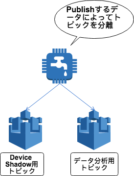

---
# 教訓

- Device Shadowに送るべきデータはアプリが把握しておくべきものか確認しよう
- 単純にデバイスのデータを送るだけであればDevice Shadowとは異なるトピックで事足りる
- AWS IoTのメッセージブローカーによって任意のトピックでPublish/Subscribe可能

---
# アジェンダ

1. どういった技術を使っているのか
1. アプリからIoTデバイスの操作に失敗する問題
1. 通知したい間隔がずれる問題 👈
1. AWS IoTのテストどうするか問題
  
---
# どういった課題が存在したのか

- ある条件を満たした場合、その条件を満たしてから特定の間隔毎に通知させたかった
- 具体的にいうと、IoTデバイスに異常が発生したらリマインド通知をするというもの
- 例えば、異常発生後5分毎にユーザへリマンド通知する
- 異常データの状態管理にDynamoDBを利用している
- リマインド通知によってユーザが異常を解消するまで指定回数まで繰り返し通知し続ける必要あり

---
# 異常データがDynamoDBに届くまで

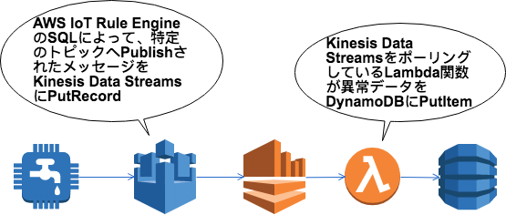

```sql
SELECT *, topic(3) as deviceId
FROM '$aws/things/+/shadow/update' 
WHERE state.reported.someIllegalState = True
```

---
# 当時の素朴なアーキテクチャ

---
# CloudWatch Eventsのスケジュールを利用したリマインド通知

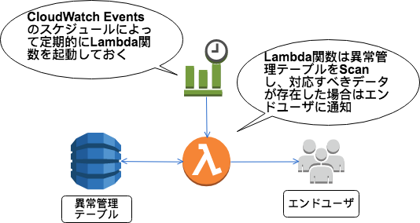

---
# 課題

- CloudWatch Eventsは異常が発生したかどうか把握できない
- そのため、常に特定の間隔毎にLambda関数を起動させてしまう
- つまり、無駄な課金が発生する
- また、 **異常が発生してから特定間隔毎** に通知ができない

---
# リマインド通知がずれるパターン

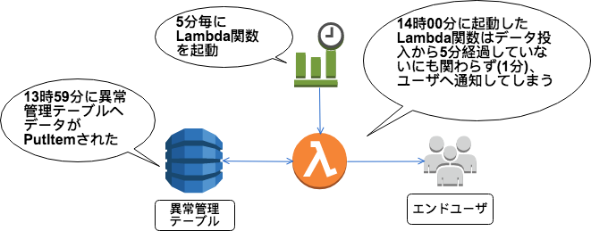

---
# どう解決したのか

---
# DynamoDB Streams<br/>+<br/>Step Functions

---
# アーキテクチャ

- 異常管理テーブルにデータがPutItemされたらDynamoDB StreamsでLambda関数を起動
- そのLambda関数がStep Functionsを起動
- 最初に5分間Wait後、リマインド判定Lambda関数を起動し通知すべきか判定
- 通知すべき場合はエンドユーザにリマインド
- これを指定回数繰り返す

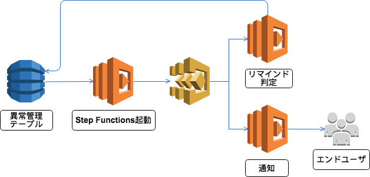

---
# ループ回数の初期設定

```javascript, [.highlight: 3-12]
...
  "States": {
    "ConfigureRemindCount": {
      "Type": "Pass",
      "Result": {
        "count": 5,
        "index": 0,
        "step": 1
      },
      "ResultPath": "$.iterator",
      "Next": "WaitAMinutes"
    },
    "WaitAMinutes": {
      "Type": "Wait",
      "Seconds": 300,
      "Next": "RemindIterator"
    },
```

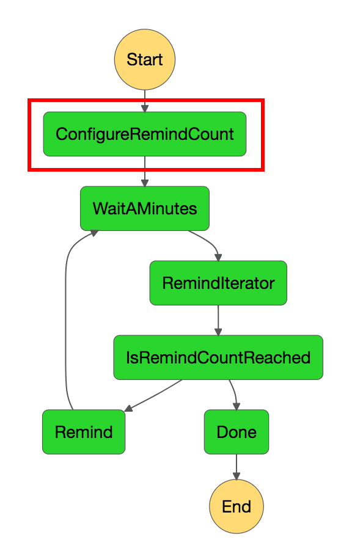

---
# 指定時間Wait

```javascript, [.highlight: 13-17]
...
  "States": {
    "ConfigureRemindCount": {
      "Type": "Pass",
      "Result": {
        "count": 5,
        "index": 0,
        "step": 1
      },
      "ResultPath": "$.iterator",
      "Next": "WaitAMinutes"
    },
    "WaitAMinutes": {
      "Type": "Wait",
      "Seconds": 300,
      "Next": "RemindIterator"
    },
```

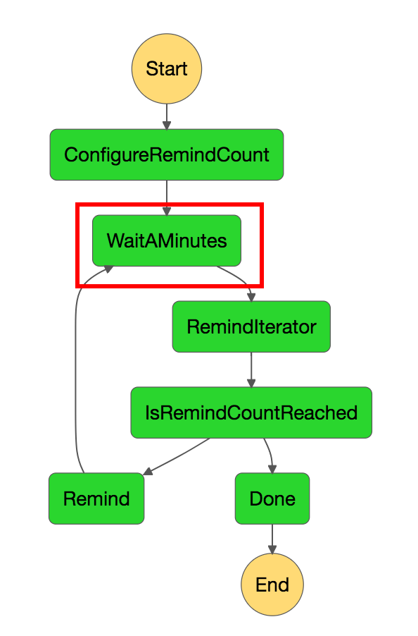

---
# リマインドの判定

```javascript, [.highlight: 2-7]
...
    "RemindIterator": {
      "Type": "Task",
      "Resource": "<_LAMBDA_ARN_>",
      "ResultPath": "$.iterator",
      "Next": "IsRemindCountReached"
    },
    "IsRemindCountReached": {
      "Type": "Choice",
      "Choices": [
        {
          "Variable": "$.iterator.continue",
          "BooleanEquals": true,
          "Next": "Remind"
        }
      ],
      "Default": "Done"
    },
```


---
# リマインド判定のコード

```python
...
def handler(event, context):
    iterator = event['iterator']
    dynamodb = boto3.resource('dynamodb').Table(os.environ['TABLE_NAME'])
    result = dynamodb.get_item(Key={'yourKey': event['yourValue']})

    if not result.get('Item'):
        return {'continue': False}

    if iterator['index'] <= iterator['count']:
        continue_ = True
    else:
        continue_ = False

    return {
        'index': iterator['index'] + iterator['step'],
        'step': iterator['step'],
        'count': iteratoro['count'],
        'continue': continue_
    }
```


---
# ループを継続するか判定

```javascript, [.highlight: 8-18]
...
    "RemindIterator": {
      "Type": "Task",
      "Resource": "<_LAMBDA_ARN_>",
      "ResultPath": "$.iterator",
      "Next": "IsRemindCountReached"
    },
    "IsRemindCountReached": {
      "Type": "Choice",
      "Choices": [
        {
          "Variable": "$.iterator.continue",
          "BooleanEquals": true,
          "Next": "Remind"
        }
      ],
      "Default": "Done"
    },
```

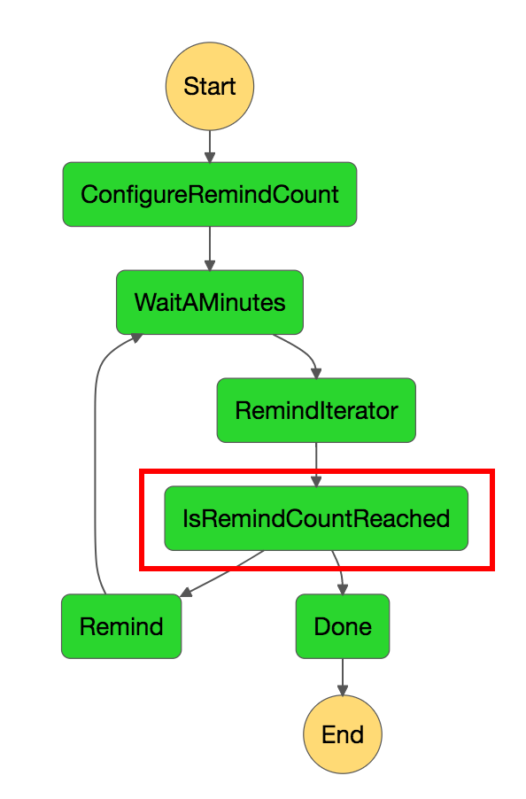

---
# リマインド通知

```javascript, [.highlight: 2-6]
...
    "Remind": {
      "Type": "Task",
      "Resource": "<_LAMBDA_ARN_>",
      "Next": "WaitAMinutes"
    },
    "Done": {
      "Type": "Pass",
      "End": true
    }
  }
}
```

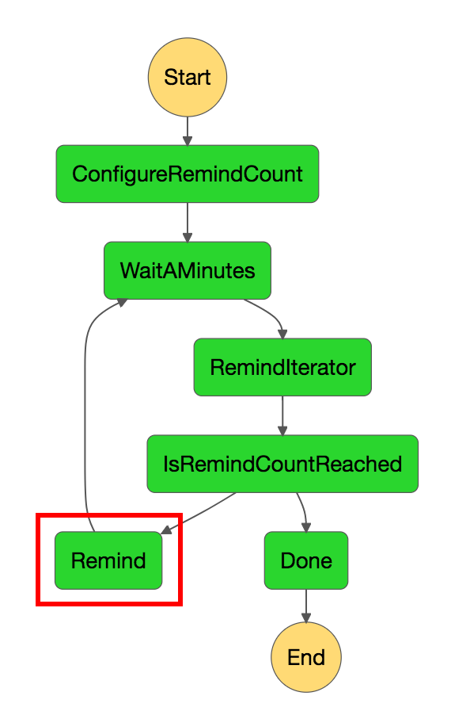

---
# ループの終了

```javascript, [.highlight: 7-10]
...
    "Remind": {
      "Type": "Task",
      "Resource": "<_LAMBDA_ARN_>",
      "Next": "WaitAMinutes"
    },
    "Done": {
      "Type": "Pass",
      "End": true
    }
  }
}
```

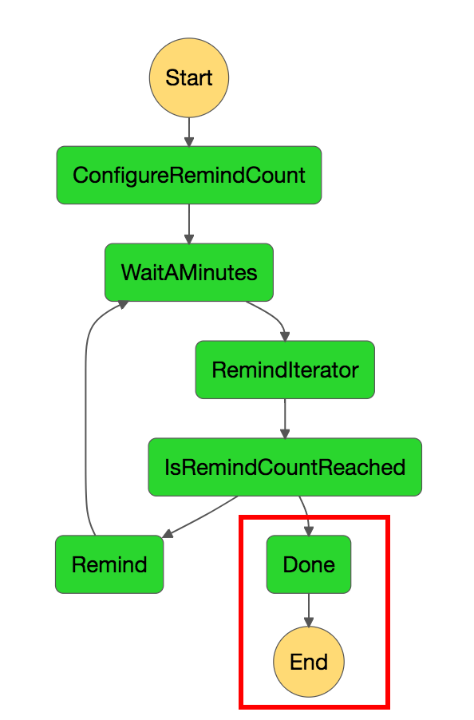

---
# アジェンダ

1. どういった技術を使っているのか
1. アプリからIoTデバイスの操作に失敗する問題
1. 通知したい間隔がずれる問題
1. AWS IoTのテストどうするか問題 👈

---
# 課題

- AWS IoTの振る舞いをテストしたい
- でもどう書くのがいいのか分からん 😇
- このあたりの情報はあまり少ない？
- 手探りでがんばるスタイル 💪

---
# 今はこんな感じでテスト書いてます

---
# テストに利用しているモジュール

- テストフレームワーク: pytest[^5]
  - 標準のunittestモジュールより高機能っぽいので
- AWS IoTのモック: moto[^4]
- E2E: AWS IoT Device SDK for Python[^6]
  - paho[^7]より抽象化されていて使いやすかった

[^4]: https://github.com/spulec/moto

[^5]: https://github.com/pytest-dev/pytest

[^6]: https://github.com/aws/aws-iot-device-sdk-python

[^7]: http://www.eclipse.org/paho/

---
# ユニットテスト

---
# ユニットテストの戦略

- motoを利用してBoto3のIoT[^8]/IoTDataPlane[^9]をモック化
- pytestの `conftest.py` でfixutreを定義しておく
- 各種テストケースでfixtureを呼び出してテスト条件を設定する
- テストケースをパラメータ化してシンプルな記述でテストカバレッジを高める

[^8]: http://boto3.readthedocs.io/en/latest/reference/services/iot.html

[^9]: http://boto3.readthedocs.io/en/latest/reference/services/iot-data.html

---
# テスト対象のメソッド

- 特定のThingが存在するか判定しているだけ

```python
class IoTHandler(object):
    ...
    def _does_thing_exist(self, thing_name):
        response = self.iot.describe_thing(thingName=thing_name)

        if thing_name == response.get('thingName'):
            return True
        else:
            return False
```

---
# ユニットテストのコード

```python
class TestDoesThingExist(object):
    @pytest.mark.usefixtures('create_thing')
    @pytest.mark.parametrize(
        'thing_name, expected', [
            ('my_thing_01', True),
            ('my_thing_02', False)
        ])
    def test_some_things_exist(self, thing_name, expected):
        actual = IoTHandler()._does_thing_exist(thing_name)

        assert actual is expected
```

---
# テスト対象のメソッド

- Boto3の振る舞いをモックさせたい
- また、Thingがすでに存在している状況を作りたい

```python, [.highlight: 4]
class IoTHandler(object):
    ...
    def _does_thing_exist(self, thing_name):
        response = self.iot.describe_thing(thingName=thing_name)

        if thing_name == response.get('thingName'):
            return True
        else:
            return False
```

---
# ユニットテストのコード

- テストしたい前提条件(Thingがすでに存在している)を整える

```python, [.highlight: 2]
class TestDoesThingExist(object):
    @pytest.mark.usefixtures('create_thing')
    @pytest.mark.parametrize(
        'thing_name, expected', [
            ('my_thing_01', True),
            ('my_thing_02', False)
        ])
    def test_some_things_exist(self, thing_name, expected):
        actual = IoTHandler()._does_thing_exist(thing_name)

        assert actual is expected
```

---
# Thingを事前に作成( `conftest.py` )

```python
from moto import mock_iot

@pytest.fixture(scope='function')
def create_thing(request):
    mock = mock_iot()
    mock.start()
    iot = boto3.client('iot')
    iot.create_thing(thingName='my_thing_01')

    request.addfinalizer(lambda: mock.stop())
```

^ ちなみに、decorator/context manager(with文)でも掛けるがpytestのfixtureと併用する場合にはraw useじゃないと上手く動かない

---
# テスト対象のメソッド

- Thingが存在するか判定する分岐をテストしたい

```python, [.highlight: 6-9]
class IoTHandler(object):
    ...
    def _does_thing_exist(self, thing_name):
        response = self.iot.describe_thing(thingName=thing_name)

        if thing_name == response.get('thingName'):
            return True
        else:
            return False
```

---
# ユニットテスト

- テストしたいケースをパラメータ化

```python, [.highlight: 3-7]
class TestDoesThingExist(object):
    @pytest.mark.usefixtures('create_thing')
    @pytest.mark.parametrize(
        'thing_name, expected', [
            ('my_thing_01', True),
            ('my_thing_02', False)
        ])
    def test_some_things_exist(self, thing_name, expected):
        actual = IoTHandler()._does_thing_exist(thing_name)

        assert actual is expected
```

---
# ユニットテストのコード

- 結果をテスト

```python, [.highlight: 8-11]
class TestDoesThingExist(object):
    @pytest.mark.usefixtures('create_thing')
    @pytest.mark.parametrize(
        'thing_name, expected', [
            ('my_thing_01', True),
            ('my_thing_02', False)
        ])
    def test_some_things_exist(self, thing_name, expected):
        actual = IoTHandler()._does_thing_exist(thing_name)

        assert actual is expected
```

---
# E2Eテスト

---
# E2Eテストの重要性

- 特にサーバーレスアプリケーションではE2Eテストは重要[^10]
- ピタゴラスイッチになりがちなので、各種AWSリソースが正しく連携しているかテストしておく必要がある
- テストのフィードバックが多少遅くなってもやる価値はある

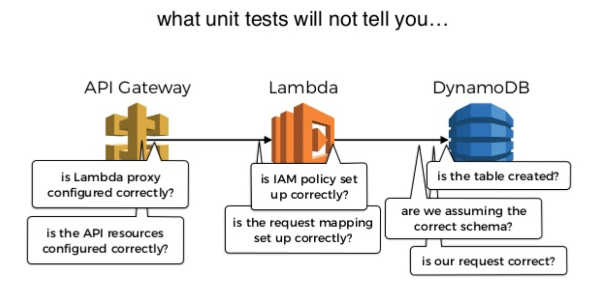

[^10]: https://www.slideshare.net/theburningmonk/serverless-in-production-an-experience-report-jeffconf-88207165/78

---
# E2Eテストの戦略

- ユニットテスト(というかmoto)では対応できない範囲をテストする
- AWS IoTに関していうとAWS IoT Rule Engineの振る舞い
- fixtureでAWS IoT Device SDK for Pythonを使い、メッセージをPublishさせておく
- 結果をチェックしてテスト

---
# テストしたいAWSリソース

- DynamoDBに異常データがPutItemされることを確認したい


---
# テスト方法

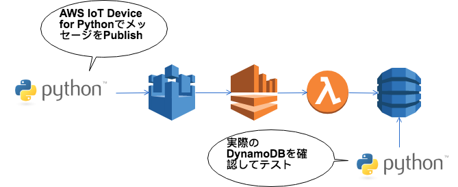

---
# メッセージのPublish

```python, [.highlight: 1-10]
@pytest.mark.parametrize(
    'publish_message', [
        (({
            'state': {
                'reported': {
                    'someIllegalState': True
                }
            }
        },))
    ], indirect=True)
def test_some_illegal_states_occured(publish_message):
    ...
```

```sql
SELECT *, topic(3) as device_id
FROM '$aws/things/+/shadow/update' 
WHERE state.reported.someIllegalState = True
```

---
# `conftest.py`

```python
@pytest.fixture(scope='function')
def publish_message(request):
    for message in request.param:
        publish2topic(iot_endpoint='_IOT_ENDPOINT_',
                      topic=f'$aws/things/{my_thing}/shadow/update',
                      message=message,
                      iot_credentials='_IOT_CREDENTIALS_')
        time.sleep(10)
        
def publish2topic(iot_endpoint, topic, message, iot_credentials):
    mqtt = AWSIoTMQTTClient('api-test')
    mqtt.configureEndpoint(iot_endpoint, 8883)

    mqtt.configureCredentials(iot_credentials['root_ca'],
                              iot_credentials['private_key'],
                              iot_credentials['certificate'])
    mqtt.connect()
    mqtt.publish(topic, json.dumps(message), 1)
```

---
# まとめ

- いくつかの課題と解決方法をご紹介
- まだまだ改善の余地はありそう
- 引き続き頑張っていくスタイル 💪
