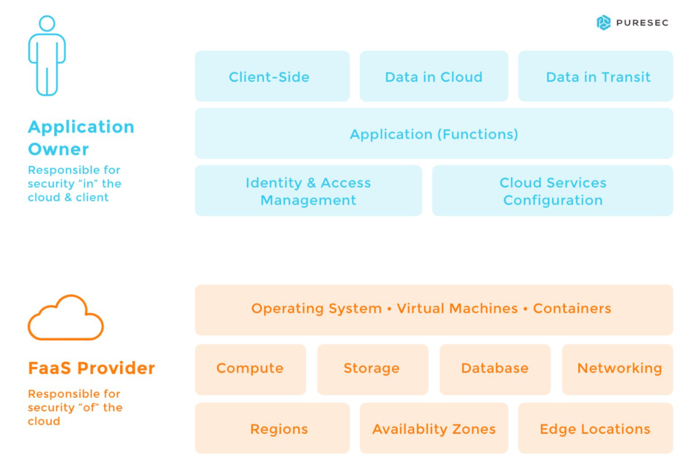
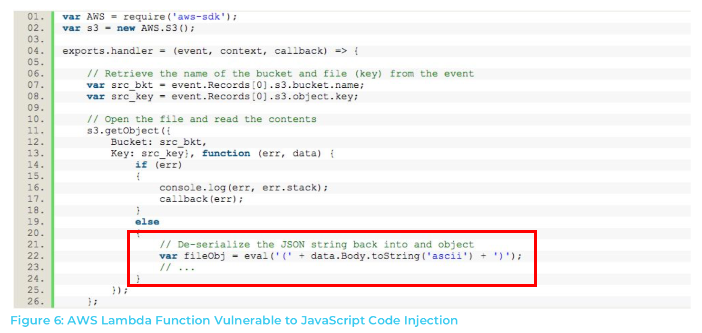
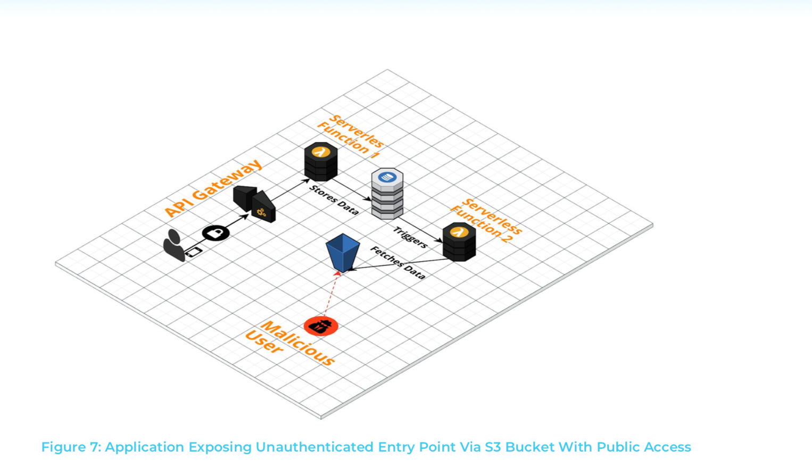
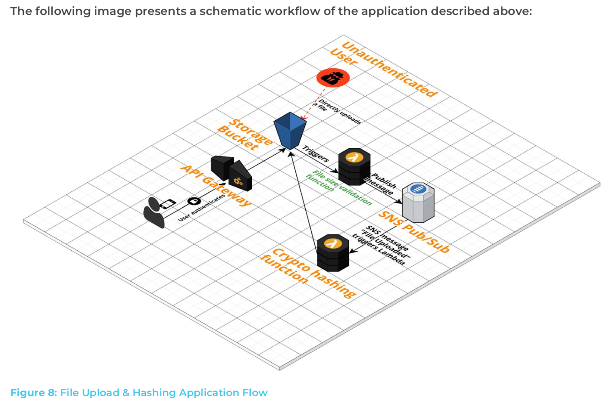

slidenumbers: true
autoscale: true
theme: Simple, 1

# The ~~Ten~~ Three Most Critical Security Risks in Serverless Architectures
### 2018/04/26 中山 幸治@姫島

---
# 自己紹介

- 中山 幸治
- クラスメソッド モバイルアプリサービス部
  - AWSソリューションアーキテクト
  - サーバーサイドエンジニア
- GitHub: [knakayama](https://github.com/knakayama)


---
# セッション内容について

- イスラエルのPureSec社[^1] が出したWhite Paperの内容を抜粋してご紹介
- このWhite Paperはサーバーレスアプリケーションで気をつけるべきセキュリティを10個紹介したもの
- 特に興味深かった3つを紹介
- より詳しくは原文参照[^2]

[^1]: https://www.puresec.io/

[^2]: https://www.puresec.io/resource-download

---
# アジェンダ

1. サーバーレスアプリケーション特有のセキュリティ
1. Function Event-Data Injection
1. Broken Authentication
1. Functions Execution Flow Manipulation

---
# アジェンダ

1. サーバーレスアプリケーション特有のセキュリティ 👈
1. Function Event-Data Injection
1. Broken Authentication
1. Functions Execution Flow Manipulation

---
# サーバーレスアプリケーションとセキュリティ

- ユーザが管理する部分が少ない反面、できることも少ない
- つまり、従来的なセキュリティの考え方がそのまま流用しづらい
  - エージェントインストール無理
  - セキュリティのテストどうやる？
- さらにまだまだ発展中の技術分野なので、デファクトスタンダード的な鉄板構成もなさそう



---
# みんなどうセキュアにするか<br/>手探りな状態っぽい 🤔

---
# ただ注意すべき点は<br/>このWhite Paperから見えるかも 😊

---
# アジェンダ

1. サーバーレスアプリケーション特有のセキュリティ
1. Function Event-Data Injection 👈
1. Broken Authentication
1. Functions Execution Flow Manipulation

---
# Function Event-Data Injection

- サーバーレスアプリケーションはイベントドリブンに処理が行われる
  - 例: S3 -> Lambda -> DynamoDB
- この際、前段のイベントから渡された情報をいろいろ加工してOutputする、というのがよく使われるパターン
- ただし、このデータをそのまま使ってしまうとセキュリティの問題になり得る
- 要するに、入力値をしっかりバリデーションしましょうという話

---
# S3 Event Notificationの例

```javascript
{
  "Records": [
    {
      ...
      "s3": {
        "s3SchemaVersion": "1.0",
        "configurationId": "testConfigRule",
        "bucket": {
          "name": "example-bucket",
          "ownerIdentity": {
            "principalId": "EXAMPLE"
          },
          "arn": "arn:aws:s3:::example-bucket"
        },
        "object": {
          "key": "example-object",
          "size": 1024,
          "eTag": "0123456789abcdef0123456789abcdef",
          "sequencer": "0A1B2C3D4E5F678901"
        }
      }
    }
  ]
}
```

---
# ダメダメな例



- オブジェクトの中身がこんなだったら 😇

```javascript
{"username":"foobar"+require('child_process').exec('uname -a')}
```

---
# アジェンダ

1. サーバーレスアプリケーション特有のセキュリティ
1. Function Event-Data Injection
1. Broken Authentication 👈
1. Functions Execution Flow Manipulation

---
# Broken Authentication

- API Gateway + Cognitoでユーザ認証導入してても他の部分で穴空いてたら意味ないですよね
- S3バケットを無駄にパブリックにしてないですか？
- デプロイメントパッケージ公開しちゃってないですか？
- ちゃんとIAM設定しよう

---
# ダメダメな例



---
# アジェンダ

1. サーバーレスアプリケーション特有のセキュリティ
1. Function Event-Data Injection
1. Broken Authentication
1. Functions Execution Flow Manipulation 👈

---
# Functions Execution Flow Manipulation

- アプリケーションのロジックを弄って悪さするというもの
- サーバーレスアプリケーションの場合、複数のAWSリソースが組み合わさって動くという特性上、1つでも穴があると悪さしやすい部分はたしかにありそう
- こっちも同じようにIAMの設定して悪さできないようにしましょうというお話

---
# Manipulationの例



---
# まとめ

- White Paperに書いてあることは結構当たり前のことしか書いてない
- ただし、当たり前のことを当たり前にするのは意外と難しい
- あえて名前をつけることでその問題を認識し、意識しやすくするのは重要
- 対策もちゃんと書いてあるので一度読んでみては 👍