slidenumbers: true
theme: Simple, 1

# Software Testing in AWS IoT<br/>with<br/>The Power of Python
### Serverless Meetup Tokyo #10<br/>2018/08/31 Koji Nakayama

---
# 自己紹介

- 中山 幸治
- クラスメソッド株式会社
  - サーバーレス開発部
  - サーバーサイドエンジニア
- GitHub: [knakayama](https://github.com/knakayama)
- 好きなもの: 東南アジア


---
# セッション内容について

- 話すこと
  - AWS IoTを利用したアーキテクチャ
  - AWS IoTに対するインテグレーションテスト
  - Pythonにおけるその実装例
- 話さないこと
  - ハードウェアの話

^explanation:
- 今時分が関わっている案件についての話であることを強調する

---
# 資料公開します

---
# アジェンダ

1. AWS IoTを利用したアーキテクチャ
1. テスト方法を考える
1. Pythonによる実装例

^explanation:
- 自分達の案件ではどういったものを作っていて
- それの何をテストしたいのか
- で、実装例を紹介、という流れ

---
# アジェンダ

1. AWS IoTを利用したアーキテクチャ 👈
1. テスト方法を考える
1. Pythonによる実装例

---
# AWS IoTでできる主なこと

- IoTデバイスのデータ収集
  - 車の位置情報を地図にプロットする
  - 温度/風向きなどの天気情報をアプリで表示する
- IoTデバイスの制御
  - 帰宅前にエアコンの電源をつける
  - 乗車前に車の温度を変える

^explanation:
- IoTデバイスとは基本的にネットワークに接続された機器/デバイスと考えてOK

---
# AWS IoTでできる主なこと

- IoTデバイスのデータ収集 👈 今回はこちらにフォーカス
  - 車の位置情報を地図にプロットする
  - 温度/風向きなどの天気情報をアプリで表示する
- IoTデバイスの制御
  - 帰宅前にエアコンの電源をつける
  - 乗車前に車の温度を変える

---
# IoTデバイスのデータを収集するアーキテクチャ

---
# IoTデバイスのデータ収集

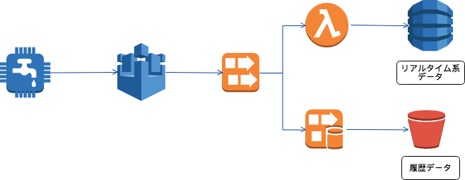

---
# IoTデバイス - AWS IoT


---
# AWS IoT - Kinesis Data Streams

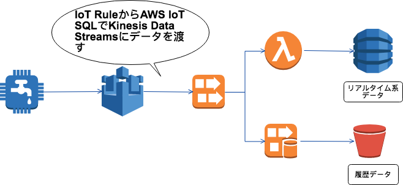

---
# IoT RuleとAWS IoT SQL

- IoT RuleはSQLを利用してIoTデバイスから送られてきたデータを操作し、後続のAWSサービスにそのデータを渡すことができる

```sql
SELECT *, topic(3) as deviceId, timestamp() as timestamp
FROM '$aws/things/+/shadow/update'
WHERE state.reported.temperature > 20
```

---
# Kinesis Data Streams - Consumers

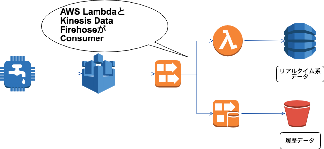

---
# Consumers - Storage

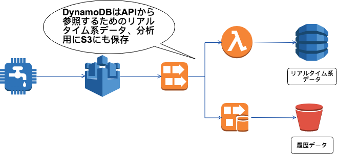

---
# IoTデバイスのデータを参照するアーキテクチャ

---
# IoTデバイスのデータ参照

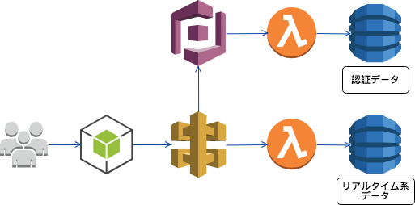

---
# ユーザ - モバイルアプリ

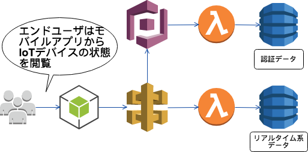

---
# モバイルアプリ - 認証

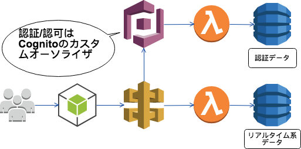

---
# モバイルアプリ - API Gateway

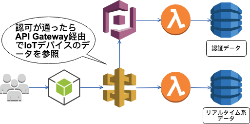

---
# アジェンダ

1. AWS IoTを利用したアーキテクチャ
1. テスト方法を考える 👈
1. Pythonによる実装例

---
# 何をテストしたいのか

- テストしたい点は2つ
  - IoTデバイスのデータはストレージに保存できる？
  - APIからそのデータを参照できる？
- 要するにインテグレーションテストをしたい

---
[.autoscale: true]

# インテグレーションテストをどこでやるか

- モック系ツール vs AWSの実環境
- モック系ツール(LocalStack/moto/etc...)で対応可能な場合は基本それで済ませてる
  - フィードバックループを優先
  - モック系ツールでのインテグレーションテストを多く書いて、AWS実環境でのインテグレーションを少なくする戦略
- IoT Ruleはそもそも未対応なようなのでAWSの実環境で実施

---
# アジェンダ

1. AWS IoTを利用したアーキテクチャ
1. テスト方法を考える
1. Pythonによる実装例 👈

---
# テストの概略

- MQTTクライアントでデータを保存
  - これをテスト前に実施しておく
- HTTPクライアントでAPIからそのデータを参照
- 期待したデータが取得できるかテスト

---
# MQTTクライアントでデータを保存

---
# PythonによるMQTT接続

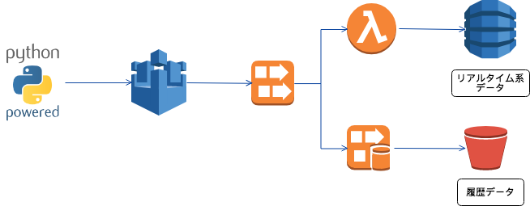

---
# PythonによるMQTT接続


---
# HTTPクライアントでデータを参照

---
# HTTPクライアントによるデータ参照

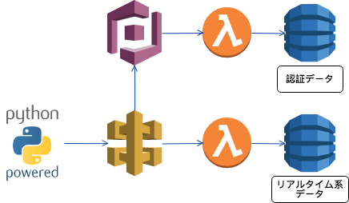

---
# HTTPクライアントによるデータ参照

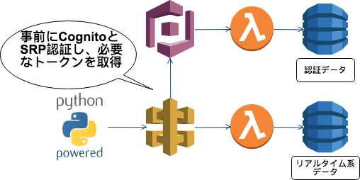

---
# HTTPクライアントによるデータ参照

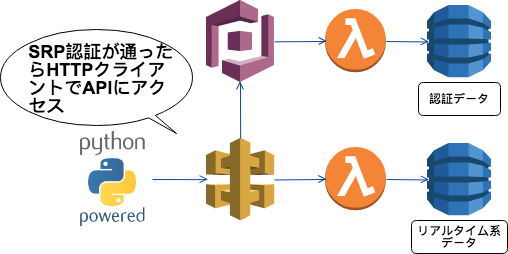

---
# 利用するモジュール

- MQTTクライアント: AWS IoT Device SDK for Python
- テストフレームワーク: pytest
- その他:
  - HTTPクライアント: requests
  - CognitoとのSRP: warrant
  - AWS IoTとのリトライ処理: tenacity

---
# テストデータの準備

```python
@pytest.mark.parametrize(
    'publish_message', [
        (({
            'state': {
                'reported': {
                    'foo': 'bar',
                    'baz': 'qux'
                }
            }
        }))
    ], indirect=True)
def test_fetch_device_data(api_endpoint, token, publish_message):
    ...
```

---
[.autoscale: true]

# 解説

- pytestはfixtureという仕組みでヘルパ関数を `conftest.py` に記述可能[^1]
- テストケースの引数にfixtureを渡して、テスト前にそれを実行できる
  - ここでMQTTクライントからデータのPublishとSRP認証を済ませておく
- `@pytest.mark.parametrize` でテストデータをパラメータ化し、1つのテストケースで網羅性を高めることができる[^2]
- `indirect=True` しておくとfixtureにテストデータを渡すことができる[^3]

[^1]: https://docs.pytest.org/en/latest/plugins.html

[^2]: https://docs.pytest.org/en/latest/parametrize.html

[^3]: https://docs.pytest.org/en/latest/example/parametrize.html#apply-indirect-on-particular-arguments

---
# MQTTクライントからのPublish

```python
from AWSIoTPythonSDK.MQTTLib import AWSIoTMQTTClient

@pytest.fixture(scope='function')
@retry(stop=stop_after_attempt(5), wait=wait_exponential(multiplier=1, max=10))
def publish_message(request):
    ...
    mqtt = AWSIoTMQTTClient('my_thing_01')
    mqtt.configureEndpoint(..., 8883)

    mqtt.configureCredentials(...)
    mqtt.connect()
    for message in request.param:
        mqtt.publish(topic, json.dumps(message), 1)
        time.sleep(5)
```

---
[.autoscale: true]

# 解説

- fixtureはデコレータで複数指定できる
- pytestはscopeという仕組みでfixtureをテストケース間で共有することが可能[^4]
  - オブジェクトの生成にコストがかかるfixtureを共有しておくとパフォーマンスが高まる
- tenacityの `retry` デコレータでAWS IoTエンドポイントとのリトライ処理を記述[^5]
- pytest標準の `request` fixtureでパラメータ化されたテストデータを参照している[^6]

[^4]: https://docs.pytest.org/en/latest/fixture.html#scope-sharing-a-fixture-instance-across-tests-in-a-class-module-or-session

[^5]: https://github.com/jd/tenacity

[^6]: https://docs.pytest.org/en/latest/reference.html#request

---
# requestsモジュールでAPIにアクセス

```python
import requests

@pytest.mark.parametrize(
    'publish_message', [
        ...
def test_fetch_device_data(api_endpoint, token, publish_message):
    response = requests.get(f'{api_endpoint}/devices/my_thing_01',
                            headers={'Authorization': token})
    body = response.json()
    assert response.status_code == 200
    assert body['deviceId'] == 'my_thing_01'
```

---
# warrantによるCognitoのSRP

```python
from warrant.aws_srp import AWSSRP

@pytest.fixture(scope='session')
def token():
    config_abs_path = str(pathlib.Path(__file__).parent.joinpath('configs').resolve())
    config = json.load(open(f'{config_abs_path}/config.json', 'r'))

    aws = AWSSRP(username=config['username'], password=config['password'],
                 pool_id=config['pool_id'], client_id=config['client_id'],
                 client=boto3.client('cognito-idp'))
    tokens = aws.authenticate_user()
    return tokens['AuthenticationResult']['AccessToken']
```

---
[.autoscale: true]

# 解説

- テストケースの引数に `token` fixtureを定義、HTTPヘッダにトークンを設定してAPIをGET
- 取得した結果が意図したものか `assert` でテスト

---
# まとめ

- AWS IoTを使うとIoTデバイスのデータ収集/制御ができる
- サーバーレスアプリケーションのインテグレーションテストはテストに応じて実行環境を考慮すべき
- Pythonのモジュールを使うと意外と簡単にインテグレーションテスト書ける